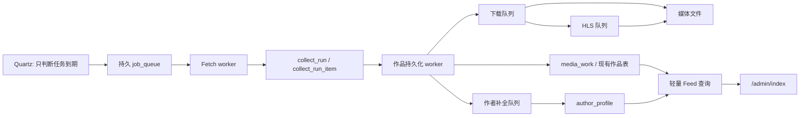

# Stream Vault 稳定性与性能升级路线图设计

> 日期：2026-07-25
> 状态：待用户审阅
> 范围：作者身份、收藏任务、SQLite 体积与并发、媒体 Feed/起播、PostgreSQL 迁移、Redis 与分布式 worker
> 原则：先修正确性，再替换基础设施；生产数据库只通过可预览、可审计、可回滚的入口变更。

## 1. 文档目的

本设计把已经确认的近期、中期、远期方案落实为可以逐个 PR 实施的规格。它不是一次性重写方案，也不要求立刻把 SQLite 换成 PostgreSQL。实施顺序如下：

1. 在 SQLite 上修复已确认的数据归集、事务、错误状态和队列问题。
2. 去掉新数据中的重复大 JSON，建立轻量读取模型和运行记录模型。
3. 在行为稳定、测试覆盖和数据口径统一后迁移 PostgreSQL。
4. PostgreSQL 成为唯一事实来源后，再按实际负载引入 Redis、独立 worker、对象存储/CDN 和完整可观测性。

这套顺序解决两个风险：

- PostgreSQL 能提升并发能力，但不会自动修复错误的平台匹配、被吞掉的异常或低效的全量抓取。
- 如果带着错误语义迁移，迁移只会把问题复制到更复杂的基础设施中，回滚和排查成本更高。

## 2. 目标与非目标

### 2.1 目标

- 抖音作者始终以 `platform_key=douyin + sec_uid` 唯一归集。
- `nickname` 只表示当前显示名及历史显示名，`unique_id` 只表示可变的抖音号，任何一个都不得充当作者主键。
- 新作品即使作者 profile 外部请求失败，也能正常入库，并进入可重试的作者补全队列。
- 收藏任务的每次运行都有独立、持久、可查询的状态；进程终止、数据库失败、外部抓取失败不再伪装成“已提交待处理”或“执行完成”。
- SQLite 阶段保持单写者策略，消除作者表 `GenerationType.TABLE` 导致的 `SQLITE_BUSY_SNAPSHOT`。
- 停止为新作品重复写入完整原始 JSON，并逐步移除读取链路对大字段的依赖。
- `/admin/index` 的 Feed 使用轻量投影和游标分页，保留作者、标题/摘要、发布时间、封面、播放地址、类型和原链等基本信息。
- 后台任务可被全局或按类别强制暂停；定时触发在暂停期间明确记录为跳过，不偷偷执行。
- PostgreSQL 迁移可演练、可验证、可回滚，且不依赖在生产库上直接试错。
- Redis 只承担缓存、协调和实时状态，不成为作品、作者、任务的唯一事实来源。

### 2.2 非目标

- 本阶段不直接修改仓库中的生产数据库副本 `db/spirit.db`。
- 本阶段不在线执行 `VACUUM`，尤其不对约 1.9 GB 的生产 SQLite 文件执行阻塞式整理。
- 不在 SQLite 阶段通过增加 Quartz 线程数解决积压；这会放大写锁竞争。
- 不在 Redis 中保存媒体二进制、完整原始 JSON 或唯一一份持久任务。
- 不以一次大 PR 同时完成全部阶段。
- 不在本设计中修改移动端起播链路；媒体优化目标是 Docker 内 Web 管理端，主要页面为 `/admin/index`。

## 3. 已确认的生产证据

### 3.1 作者归集并非缺少 UID，而是查询平台口径不一致

生产数据库副本只读分析结果：

| 指标 | 结果 |
|---|---:|
| 作品中不同的有效 `MS4...` UID | 208 |
| 能覆盖这些 UID 的作者档案 | 208 |
| 同一作品 `authoruid/secuid` 均合法但互相冲突 | 0 |
| 缺少历史 nickname 配对 | 0 |

当前数据使用了两种平台表示：

- `biz_video.videoplatform = 抖音`
- `biz_graphic_content.platform = douyin`

当前 `AuthorProfileService.buildVideoAuthorSpec()` 和 `buildGraphicAuthorSpec()` 都先对显示平台字段做精确匹配，因此同一个 `sec_uid` 会被拆成两个作品集合。

已验证示例 UID：

```text
MS4wLjABAAAAKouSmCULyRPvwO2ECzsUljHEmlAxvRIJSy3Q30VEuu0
```

该作者有 1050 条视频、8 条图文：

- 从视频入口打开：得到 `1050 + 0`。
- 从图文入口打开：得到 `0 + 8`。

结论：历史数据主体已包含 canonical UID，首要修复是查询统一使用 `platformkey + sec_uid`，不是再次按 nickname 猜作者，也不是盲目重跑外部 profile。

### 3.2 “已提交待处理”包含已发生但被掩盖的数据库失败

生产数据与日志结果：

| 指标 | 结果 |
|---|---:|
| 监控任务数 | 149 |
| 表面停留在“已提交待处理”的任务 | 18 |
| `SQLITE_BUSY_SNAPSHOT` 匹配日志 | 54 行，即 27 次失败 |
| 稳定失败模式 | 9 个任务，每个 3 轮 |

任务 `146-154` 实际都成功抓取了 3 至 23 个作品，但作者档案数和已处理详情数仍为 0。根错误是：

```text
SQLITE_BUSY_SNAPSHOT
Another database connection has already written to the database
insert into biz_author_profile ...
```

根因链路：

1. 作品处理事务先读取 SQLite WAL 快照。
2. `AuthorProfileEntity` / `AuthorNameHistoryEntity` 使用 `GenerationType.TABLE`。
3. Hibernate 通过另一个连接更新 `seq_common` 分配 ID。
4. 原事务回到旧 WAL 快照后尝试写作者档案。
5. SQLite 判定该读快照已过期，抛出 `SQLITE_BUSY_SNAPSHOT`。
6. 当前 `CollectDataService.submitCollectData()` 捕获异常后只打印简短消息，不再抛出。
7. `CollectDataJob` 因此继续打印“任务执行完成”，任务状态仍停留在“已提交待处理”。

作者表序列证据：

| 实体 | 行数 | 最大 ID | `seq_common` |
|---|---:|---:|---:|
| 作者档案 | 213 | 382 | 486 |
| 作者历史名 | 243 | 412 | 516 |

`busy_timeout` 只能等待普通锁释放，不能把已过期快照变成可写快照，因此单纯提高超时时间不能解决此错误。

### 3.3 调度器不是异步队列

当前 Docker 配置：

```properties
spring.quartz.properties.org.quartz.threadPool.threadCount=1
spring.quartz.job-store-type=memory
```

现有任务在 `CollectDataScheduler_Worker-1` 同步执行。149 个监控任务可能共享相同或相近 cron，再叠加任务间隔，容易形成长队列。任务 `102` 为找到 20 条新作品请求了 988 条历史作品，仅 F2 阶段耗时约 8 分 46 秒；它还在 2026-07-25 10:09:21 遭遇容器关闭，因此保留了过期的 pending 状态。

结论：

- Quartz 当前既负责“到期触发”，又直接承担长耗时执行。
- 增加 Quartz 线程在 SQLite 上会增加同时写库的机会。
- 正确方向是 Quartz 只生产持久队列项，由受控 worker 消费；SQLite 阶段写入并发保持 1。

### 3.4 数据库大字段和读取模型相互缠绕

当前视频实体包含 `jsonData` 和历史 `videoinfo` 两个逻辑相近的大字段。已有兼容代码会优先读 `videoinfo`，否则读 `jsonData`；新收藏路径曾把同一个 `rawJsonData` 同时设置给两者。图文也在作品主表保存完整 `jsonData`。

不能在没有生产审计前宣称两列 100% 一致，但可以确认：

- 新写入路径存在重复保存同一 payload 的可能。
- profile 修复、NFO 生成、维护服务等路径仍会读取大 JSON。
- `lastfetchsnapshot` / `lastplanitems` 把整批列表 JSON 放在任务主表中。
- 旧的 200000 字符截断会生成不完整 JSON，导致 `[AuthorStats] parse snapshot failed ... unclosed string`。

数据库 1.9 GB 不代表 JVM 会把整个 SQLite 文件一次性载入内存。内存压力主要来自查询结果实体、大 JSON 反序列化、全列表快照、抓取响应、下载缓冲、HLS/FFmpeg 子进程以及没有边界的集合；SQLite 文件页由操作系统缓存，并不等价于同等大小的 Java heap。

## 4. 全局不变量

所有阶段必须保持以下不变量：

### 4.1 作者身份不变量

```text
AuthorKey = normalized platform_key + canonical author_uid
Douyin AuthorKey = "douyin" + sec_uid(MS4...)
```

- 抖音 `author_uid` 必须是合法 `MS4...`，不得回退到纯数字 `uid`。
- `nickname/displayname` 是可变展示属性。
- `username/unique_id` 是可变账号名，允许为空，允许修改，不保证全局唯一。
- 历史名称只记录 nickname，不将数字 UID 或 sec_uid 当作 nickname 填入。
- 外部 profile 空字段不得覆盖数据库中已有非空字段。
- 同 UID 的视频、图文和作者档案必须能在一次查询中归集。

### 4.2 作品入库不变量

- 作品有合法平台作品 ID 才可幂等入库。
- 抖音作品有合法 `sec_uid` 时，必须在作品轻量字段写入该 UID。
- profile 获取失败不是作品入库失败。
- 原始 payload 最多保留一份；轻量列表禁止读取它。
- 下载、HLS、作者补全的失败不能回滚已经成功提交的作品元数据。

### 4.3 任务不变量

- 一次触发对应一个 `collect_run`。
- 同一收藏任务同时最多有一个 `QUEUED/FETCHING/PROCESSING` 运行。
- 每个终态都保存结束时间和可读原因。
- 已成功的上一轮统计在新一轮抓取成功前不得被清零。
- 进程重启后，过期运行必须转为 `INTERRUPTED`，不能永久 pending。
- 暂停状态下，到期任务记录 `SKIPPED_PAUSED`，不执行外部请求和写作品。

### 4.4 数据库与事务不变量

- 外部 HTTP、文件下载和 FFmpeg 不得持有数据库事务。
- SQLite 写事务必须短小且单写者。
- `SQLITE_BUSY` 重试必须从新事务开始。
- 失败事务中的 `EntityManager` 不可继续复用。
- 维护操作先 preview，再 apply；apply 必须有操作日志和批次进度。

### 4.5 Feed 不变量

- Feed 返回作者名、canonical UID、标题或摘要、发布时间、下载时间、封面、媒体类型、播放资源、原链。
- Feed 不返回完整原始 JSON。
- 相同排序键下以稳定唯一 ID 作为最终 tie-breaker。
- 游标分页不得重复或跳过同一排序快照中的作品。
- 浏览器只预载当前项和相邻项，不创建整页播放器列表。

## 5. 目标架构总览



近期 SQLite 版本中，以上队列都在同一个 SQLite 数据库中，只有一个数据库写 worker；网络抓取和媒体处理可以并行，但最终写库需串行提交。中期 PostgreSQL 版本允许不同类型 worker 并行领取任务。远期 Redis 只加速通知、锁、缓存和实时进度，不替代图中的持久表。

---

# 第一阶段：近期修复，继续使用 SQLite

## 6. PR 1：统一作者身份与跨视频/图文归集

### 6.1 修改文件

- `backstage/src/main/java/com/flower/spirit/utils/AuthorIdentityUtil.java`
- `backstage/src/main/java/com/flower/spirit/platform/PlatformCatalog.java`
- `backstage/src/main/java/com/flower/spirit/service/AuthorProfileService.java`
- `backstage/src/main/java/com/flower/spirit/service/MediaFeedService.java`
- `backstage/src/main/java/com/flower/spirit/config/DatabaseIndexInitializer.java`
- 对应 DAO 与测试。

### 6.2 归一化 API

目标是把平台显示名和平台键彻底分离。业务查询只接受 canonical key；显示名只用于 UI。

```java
public final class AuthorIdentityUtil {
    public static final String DOUYIN = "douyin";

    public static String canonicalPlatformKey(String platformKey, String legacyDisplay) {
        String explicit = trimToNull(platformKey);
        if (explicit != null) {
            return explicit.toLowerCase(Locale.ROOT);
        }
        String legacy = trimToNull(legacyDisplay);
        if (legacy == null) {
            return null;
        }
        return switch (legacy.toLowerCase(Locale.ROOT)) {
            case "douyin", "抖音" -> DOUYIN;
            case "bilibili", "哔哩哔哩", "b站" -> "bilibili";
            default -> PlatformCatalog.normalizeKey(legacy);
        };
    }

    public static String canonicalDouyinUid(String... candidates) {
        for (String candidate : candidates) {
            String value = trimToNull(candidate);
            if (value != null && value.startsWith("MS4")) {
                return value;
            }
        }
        return null;
    }

    public static AuthorKey authorKey(
            String platformKey,
            String legacyPlatform,
            String authorUid,
            String secUid) {
        String key = canonicalPlatformKey(platformKey, legacyPlatform);
        String uid = DOUYIN.equals(key)
                ? canonicalDouyinUid(secUid, authorUid)
                : firstNotBlank(authorUid, secUid);
        return key == null || uid == null ? null : new AuthorKey(key, uid);
    }

    public record AuthorKey(String platformKey, String authorUid) {}
}
```

规则说明：

1. `platformkey` 非空时优先使用，统一转小写。
2. 只有历史行的 `platformkey` 为空时，才允许从 `videoplatform/platform` 的别名推断。
3. 抖音 UID 只接受 `MS4...`；数字 `uid` 可以保留为上游辅助信息，但不能进入 `authoruid/secuid` canonical 字段。
4. 非抖音平台暂时沿用已有平台适配器的稳定 UID 规则，不在本 PR 重新定义。

### 6.3 共用作者谓词

视频和图文查询必须共享同一个平台语义，不能各自传入显示平台后精确比较。

```java
private Predicate canonicalPlatformPredicate(
        CriteriaBuilder cb,
        Path<String> platformKey,
        Path<String> legacyPlatform,
        String canonicalKey) {
    Predicate canonical = cb.equal(cb.lower(platformKey), canonicalKey);
    Predicate blankKey = cb.or(
            cb.isNull(platformKey),
            cb.equal(cb.trim(platformKey), ""));
    Predicate legacyAlias = legacyPlatform.in(PlatformCatalog.aliases(canonicalKey));
    return cb.or(canonical, cb.and(blankKey, legacyAlias));
}

private Predicate canonicalUidPredicate(
        CriteriaBuilder cb,
        Root<?> root,
        String canonicalUid) {
    return cb.or(
            cb.equal(root.get("authoruid"), canonicalUid),
            cb.equal(root.get("secuid"), canonicalUid));
}
```

视频目标规格：

```java
private Specification<VideoDataEntity> buildVideoAuthorSpec(AuthorKey key) {
    return (root, query, cb) -> cb.and(
            canonicalPlatformPredicate(
                    cb,
                    root.get("platformkey"),
                    root.get("videoplatform"),
                    key.platformKey()),
            canonicalUidPredicate(cb, root, key.authorUid()));
}
```

图文目标规格：

```java
private Specification<GraphicContentEntity> buildGraphicAuthorSpec(AuthorKey key) {
    return (root, query, cb) -> cb.and(
            canonicalPlatformPredicate(
                    cb,
                    root.get("platformkey"),
                    root.get("platform"),
                    key.platformKey()),
            canonicalUidPredicate(cb, root, key.authorUid()));
}
```

legacy fallback 只能用于没有 canonical UID 的非抖音历史数据。对抖音不得再按 username 或 nickname 扩张结果集，否则同名作者会被错误合并。

### 6.4 作者档案 upsert

唯一查询口径：

```java
Optional<AuthorProfileEntity> findByPlatformkeyAndAuthoruid(
        String platformKey,
        String authorUid);
```

保存逻辑目标：

```java
@Transactional
public AuthorProfileEntity upsertAuthor(AuthorObservation observation) {
    AuthorKey key = requireCanonicalKey(observation);
    AuthorProfileEntity entity = authorProfileDao
            .findByPlatformkeyAndAuthoruid(key.platformKey(), key.authorUid())
            .orElseGet(AuthorProfileEntity::new);

    entity.setPlatformkey(key.platformKey());
    entity.setPlatform(PlatformCatalog.displayName(key.platformKey()));
    entity.setAuthoruid(key.authorUid());
    mergeIfNotBlank(entity::setUsername, observation.username());
    mergeIfNotBlank(entity::setDisplayname, observation.nickname());
    mergeIfNotBlank(entity::setAvatar, observation.avatar());
    mergeIfNotBlank(entity::setHomepage, canonicalHomepage(key, observation.homepage()));
    mergeIfNotBlank(entity::setSignature, observation.signature());

    AuthorProfileEntity saved = authorProfileDao.save(entity);
    recordNicknameHistory(saved.getId(), observation.nickname());
    return saved;
}
```

不得执行的逻辑：

```java
// 禁止：nickname 不是身份键
findByDisplayname(nickname);

// 禁止：数字 uid 不是抖音 sec_uid
entity.setAuthoruid(upstreamNumericUid);

// 禁止：外部空字段覆盖已有资料
entity.setUsername(response.getString("unique_id"));
```

### 6.5 索引

SQLite 近期新增：

```sql
CREATE UNIQUE INDEX IF NOT EXISTS uq_author_profile_platformkey_uid
ON biz_author_profile(platformkey, authoruid)
WHERE platformkey IS NOT NULL AND platformkey <> ''
  AND authoruid IS NOT NULL AND authoruid <> '';

CREATE INDEX IF NOT EXISTS idx_video_author_identity
ON biz_video(platformkey, authoruid, secuid, publishtime, id);

CREATE INDEX IF NOT EXISTS idx_graphic_author_identity
ON biz_graphic_content(platformkey, authoruid, secuid, publishtime, id);

CREATE UNIQUE INDEX IF NOT EXISTS uq_author_history_profile_name
ON biz_author_name_history(authorprofileid, displayname)
WHERE displayname IS NOT NULL AND displayname <> '';
```

创建唯一索引前必须先运行 preview，检查重复 profile：

```sql
SELECT platformkey, authoruid, COUNT(*) AS duplicate_count,
       GROUP_CONCAT(id) AS profile_ids
FROM biz_author_profile
WHERE platformkey IS NOT NULL AND platformkey <> ''
  AND authoruid IS NOT NULL AND authoruid <> ''
GROUP BY platformkey, authoruid
HAVING COUNT(*) > 1;
```

若存在重复，不允许启动时静默选择一个。维护入口需根据非空字段完整度、更新时间、关联历史名合并为主档案，并记录被合并 ID。

### 6.6 API 结果

作者作品 API 返回统一 identity：

```json
{
  "author": {
    "platformKey": "douyin",
    "authorUid": "MS4wLjABAAAA...",
    "username": "custom_douyin_id",
    "displayName": "当前昵称",
    "historicalNames": ["旧昵称A", "旧昵称B"],
    "avatar": "/cos/...",
    "signature": "个性签名",
    "homepage": "https://www.douyin.com/user/MS4wLjABAAAA..."
  },
  "counts": {
    "video": 1050,
    "graphic": 8,
    "total": 1058
  }
}
```

`homepage` 在抖音上必须按 canonical `sec_uid` 构造。只有可信外部 URL 与 canonical UID 一致时才沿用外部值。

### 6.7 测试

扩展 `AuthorProfileServiceTest`：

- 视频 `videoplatform=抖音`、图文 `platform=douyin`、两者 `platformkey=douyin` 且 UID 相同时返回合并集合。
- `platformkey` 为空时显示平台别名可匹配。
- `platformkey` 已明确为其他平台时，即使显示名是“抖音”也不能匹配。
- 抖音只按 `MS4...` 归集，不按 nickname/username 误合并。
- nickname 变化时更新当前名称并保留历史名称。
- username 为空时保留旧值。
- profile 主页始终包含 canonical UID。

扩展 `MediaFeedServiceTest`：

- Feed 中作者头像查找使用 canonical `AuthorKey`。
- 作品自身头像为空但 profile 有头像时能够补全。
- profile 不存在时返回明确 `authorProfileAvailable=false` 和占位状态，不抛异常。

## 7. PR 2：修复 SQLite ID 生成与事务重试

### 7.1 作者表改用 SQLite 原生 identity

修改：

```java
@Id
@GeneratedValue(strategy = GenerationType.IDENTITY)
private Integer id;
```

应用于：

- `AuthorProfileEntity`
- `AuthorNameHistoryEntity`
- 本路线图新增的 SQLite 表实体。

近期不一次性修改其他仍使用 `seq_common` 的旧实体，避免扩大回归面。后续每迁移一个高频写实体，都必须先增加测试和 schema preflight。

### 7.2 schema preflight

`GenerationType.IDENTITY` 的前提是现有表的 `id` 能由 SQLite 原生 rowid 分配。启动时只检查，不重建表：

```sql
PRAGMA table_info('biz_author_profile');
PRAGMA table_info('biz_author_name_history');
```

必须满足：

- `id` 类型为 `INTEGER`。
- `id` 是单列主键。
- 插入时允许省略 `id`，SQLite 能生成 rowid。

如果生产 schema 不满足，应用进入维护告警状态，禁止自动改表。离线迁移入口执行以下等价过程：

```sql
BEGIN IMMEDIATE;

CREATE TABLE biz_author_profile_new (
    id INTEGER PRIMARY KEY AUTOINCREMENT,
    platform TEXT,
    platformkey TEXT,
    authoruid TEXT,
    username TEXT,
    displayname TEXT,
    avatar TEXT,
    homepage TEXT,
    signature TEXT,
    createtime DATETIME,
    updatetime DATETIME
);

INSERT INTO biz_author_profile_new (
    id, platform, platformkey, authoruid, username, displayname,
    avatar, homepage, signature, createtime, updatetime
)
SELECT
    id, platform, platformkey, authoruid, username, displayname,
    avatar, homepage, signature, createtime, updatetime
FROM biz_author_profile;

-- 校验行数和最大 ID 后，维护工具才执行表名交换并重建索引。
COMMIT;
```

这个 SQL 只描述离线工具行为，不允许应用启动时直接运行。

### 7.3 事务分层

外部抓取阶段不持有事务：

```java
public FetchResult fetchCollectRun(CollectTaskSnapshot task) {
    // 无 @Transactional
    CookieLease cookie = cookieService.acquire(task.platformKey());
    RawFetchResponse response = platformGateway.fetch(task, cookie);
    return parser.parse(response);
}
```

单次持久化使用独立短事务：

```java
@Service
public class CollectWriteTransaction {
    @Transactional(propagation = Propagation.REQUIRES_NEW)
    public PersistBatchResult persistBatch(
            long runId,
            List<ParsedWork> works) {
        // 幂等写作品、运行明细、基础作者档案和后续队列。
        // 不做 HTTP、下载或 FFmpeg。
        return persist(works);
    }
}
```

重试器必须位于事务代理之外：

```java
@Service
public class SqliteWriteRetrier {
    private static final int MAX_ATTEMPTS = 3;

    public <T> T execute(Supplier<T> newTransactionCall) {
        RuntimeException last = null;
        for (int attempt = 1; attempt <= MAX_ATTEMPTS; attempt++) {
            try {
                return newTransactionCall.get();
            } catch (RuntimeException error) {
                if (!SqliteErrors.isBusy(error) || attempt == MAX_ATTEMPTS) {
                    throw error;
                }
                last = error;
                sleep(backoffWithJitter(attempt));
            }
        }
        throw last;
    }
}
```

调用方式：

```java
PersistBatchResult result = sqliteWriteRetrier.execute(
        () -> collectWriteTransaction.persistBatch(runId, batch));
```

禁止在同一个 `@Transactional` 方法内部 catch 后继续：

```java
@Transactional
public void wrong() {
    try {
        repository.save(entity);
    } catch (DataAccessException error) {
        repository.save(entity); // 错误：仍在失败/过期事务中
    }
}
```

原因：`SQLITE_BUSY_SNAPSHOT` 表示当前事务看到的 WAL 快照已经不能升级为写事务。只有回滚、释放连接并开启新事务，才能获得新快照。

### 7.4 SQLite 写入并发配置

目标配置：

```properties
spring.datasource.url=jdbc:sqlite:/app/db/spirit.db?journal_mode=WAL&busy_timeout=10000
spring.datasource.hikari.maximum-pool-size=4
spring.datasource.hikari.minimum-idle=1
spring.datasource.hikari.connection-init-sql=PRAGMA foreign_keys=ON; PRAGMA busy_timeout=10000

streamvault.sqlite.writer-concurrency=1
streamvault.sqlite.write-retry.max-attempts=3
streamvault.sqlite.write-retry.initial-delay-ms=100
streamvault.sqlite.write-retry.max-delay-ms=1000
```

连接池可大于 1，以支持并发只读和不持有事务的操作；所有应用级写入仍通过容量为 1 的写入执行器串行化。`wal_autocheckpoint` 不应固定为过小值后未经指标验证，需根据 WAL 增长和 checkpoint 延迟调整。

### 7.5 测试

- 保存新作者不再更新 `seq_common`。
- profile 和历史名连续插入生成不同 ID。
- 模拟第一次 `SQLITE_BUSY`，第二次新事务成功。
- 模拟三次失败，最终抛出原始根异常并标记运行 `DB_FAILED`。
- 验证重试期间没有重复作品、重复历史名或重复队列项。
- 并发只读不会被长时间网络请求占用的事务阻塞。

## 8. PR 3：作者补全改为非致命、可延迟任务

### 8.1 入库顺序

每条作品的处理顺序固定为：

1. 从列表响应、hybrid 响应、任务地址中提取 canonical identity。
2. 写入作品轻量字段。
3. 使用作品响应中已有的作者字段做本地 profile upsert。
4. 若 profile 不完整，写入作者补全队列。
5. 提交作品事务。
6. 后台作者 worker 再请求外部 profile。

### 8.2 完整度判定

```java
public enum AuthorField {
    DISPLAY_NAME,
    USERNAME,
    AVATAR,
    SIGNATURE,
    HOMEPAGE
}

public AuthorCompleteness inspect(AuthorObservation observation) {
    EnumSet<AuthorField> missing = EnumSet.noneOf(AuthorField.class);
    if (isBlank(observation.nickname())) missing.add(AuthorField.DISPLAY_NAME);
    if (isBlank(observation.username())) missing.add(AuthorField.USERNAME);
    if (isBlank(observation.avatar())) missing.add(AuthorField.AVATAR);
    if (isBlank(observation.signature())) missing.add(AuthorField.SIGNATURE);
    if (isBlank(observation.homepage())) missing.add(AuthorField.HOMEPAGE);
    return new AuthorCompleteness(missing);
}
```

username 为空是允许状态，不应把作品判为非法；但可以触发低优先级补全。

### 8.3 作者补全队列

SQLite 目标表：

```sql
CREATE TABLE IF NOT EXISTS biz_author_enrichment_job (
    id INTEGER PRIMARY KEY AUTOINCREMENT,
    platform_key TEXT NOT NULL,
    author_uid TEXT NOT NULL,
    state TEXT NOT NULL,
    priority INTEGER NOT NULL DEFAULT 100,
    attempt_count INTEGER NOT NULL DEFAULT 0,
    next_attempt_at DATETIME NOT NULL,
    locked_at DATETIME,
    last_error_code TEXT,
    last_error_message TEXT,
    created_at DATETIME NOT NULL,
    updated_at DATETIME NOT NULL
);

CREATE UNIQUE INDEX IF NOT EXISTS uq_author_enrichment_active
ON biz_author_enrichment_job(platform_key, author_uid)
WHERE state IN ('QUEUED', 'RUNNING', 'RETRY_WAIT');
```

队列写入：

```java
public void enqueueIfIncomplete(AuthorObservation observation) {
    AuthorKey key = requireCanonicalKey(observation);
    if (inspect(observation).isComplete()) {
        return;
    }
    authorEnrichmentJobDao.enqueueIfAbsent(
            key.platformKey(),
            key.authorUid(),
            Instant.now());
}
```

worker 规则：

- 同一作者同一时刻最多一个活动任务。
- 外部 429/风控进入指数退避并切换 cookie，不立即密集重试。
- 404/明确不存在进入长期冷却，保留原因。
- profile 返回 UID 与目标 UID 不一致时拒绝写入，状态为 `IDENTITY_MISMATCH`。
- 保存失败只重试数据库事务，不重复外部请求；外部响应在本轮内保存在内存对象中。
- 手动“刷新”按钮可提升已有队列项优先级，也可在没有队列项时新建一条。

### 8.4 失败隔离

```java
PersistWorkResult persistWork(ParsedWork work) {
    PersistWorkResult result = workWriter.persist(work);
    try {
        authorQueue.enqueueIfIncomplete(work.author());
    } catch (RuntimeException error) {
        logger.error("[AuthorEnrichment] enqueue failed workId={} platformKey={} authorUid={}",
                work.workId(), work.platformKey(), work.authorUid(), error);
        // 作品已成功入库。由周期性扫描补回漏掉的作者任务。
    }
    return result;
}
```

同时增加低频 reconciliation 扫描：只查轻量列，找出有 canonical UID 但 profile 不存在或资料过期的作品；不得解析 `jsonData`。

## 9. PR 4：收藏运行状态机与持久队列

### 9.1 内部状态

```java
public enum CollectRunState {
    QUEUED,
    FETCHING,
    PROCESSING,
    COMPLETED,
    FETCH_FAILED,
    DB_FAILED,
    INTERRUPTED,
    SKIPPED_PAUSED,
    CANCELLED
}
```

允许转换：

```text
QUEUED -> FETCHING | CANCELLED | SKIPPED_PAUSED
FETCHING -> PROCESSING | FETCH_FAILED | INTERRUPTED
PROCESSING -> COMPLETED | DB_FAILED | INTERRUPTED
FETCH_FAILED -> QUEUED
DB_FAILED -> QUEUED
INTERRUPTED -> QUEUED
```

不允许从终态直接改为 `FETCHING`；重试必须创建新 run，原 run 保留审计记录。

中文显示只在 DTO/UI 映射：

```java
public String displayLabel(CollectRunState state) {
    return switch (state) {
        case QUEUED -> "排队中";
        case FETCHING -> "正在抓取";
        case PROCESSING -> "正在入库";
        case COMPLETED -> "已完成";
        case FETCH_FAILED -> "抓取失败";
        case DB_FAILED -> "数据库失败";
        case INTERRUPTED -> "执行中断";
        case SKIPPED_PAUSED -> "暂停期间已跳过";
        case CANCELLED -> "已取消";
    };
}
```

### 9.2 数据表

`biz_collect_data` 继续保存任务定义，不再保存大列表和单次运行的完整过程。

```sql
CREATE TABLE IF NOT EXISTS biz_collect_run (
    id INTEGER PRIMARY KEY AUTOINCREMENT,
    collect_task_id INTEGER NOT NULL,
    trigger_type TEXT NOT NULL,
    state TEXT NOT NULL,
    requested_limit INTEGER,
    fetched_count INTEGER,
    planned_count INTEGER,
    inserted_count INTEGER,
    skipped_existing_count INTEGER,
    failed_item_count INTEGER,
    started_at DATETIME,
    heartbeat_at DATETIME,
    finished_at DATETIME,
    error_code TEXT,
    error_message TEXT,
    error_detail TEXT,
    created_at DATETIME NOT NULL
);

CREATE INDEX IF NOT EXISTS idx_collect_run_task_created
ON biz_collect_run(collect_task_id, created_at DESC, id DESC);

CREATE INDEX IF NOT EXISTS idx_collect_run_state_heartbeat
ON biz_collect_run(state, heartbeat_at);
```

每次抓取到的列表项写为轻量明细：

```sql
CREATE TABLE IF NOT EXISTS biz_collect_run_item (
    id INTEGER PRIMARY KEY AUTOINCREMENT,
    run_id INTEGER NOT NULL,
    ordinal INTEGER NOT NULL,
    platform_key TEXT NOT NULL,
    work_id TEXT NOT NULL,
    author_uid TEXT,
    nickname_snapshot TEXT,
    title_snapshot TEXT,
    publish_time DATETIME,
    media_type TEXT,
    decision TEXT NOT NULL,
    process_state TEXT NOT NULL,
    error_code TEXT,
    error_message TEXT,
    created_at DATETIME NOT NULL,
    updated_at DATETIME NOT NULL,
    FOREIGN KEY(run_id) REFERENCES biz_collect_run(id)
);

CREATE UNIQUE INDEX IF NOT EXISTS uq_collect_run_item_work
ON biz_collect_run_item(run_id, platform_key, work_id);

CREATE INDEX IF NOT EXISTS idx_collect_run_item_run_ordinal
ON biz_collect_run_item(run_id, ordinal);
```

持久队列：

```sql
CREATE TABLE IF NOT EXISTS biz_job_queue (
    id INTEGER PRIMARY KEY AUTOINCREMENT,
    job_type TEXT NOT NULL,
    dedupe_key TEXT NOT NULL,
    payload TEXT NOT NULL,
    state TEXT NOT NULL,
    priority INTEGER NOT NULL DEFAULT 100,
    available_at DATETIME NOT NULL,
    attempt_count INTEGER NOT NULL DEFAULT 0,
    max_attempts INTEGER NOT NULL DEFAULT 3,
    locked_by TEXT,
    locked_at DATETIME,
    last_error_code TEXT,
    last_error_message TEXT,
    created_at DATETIME NOT NULL,
    updated_at DATETIME NOT NULL
);

CREATE UNIQUE INDEX IF NOT EXISTS uq_job_queue_active_dedupe
ON biz_job_queue(job_type, dedupe_key)
WHERE state IN ('QUEUED', 'RUNNING', 'RETRY_WAIT');

CREATE INDEX IF NOT EXISTS idx_job_queue_claim
ON biz_job_queue(state, available_at, priority, id);
```

### 9.3 Quartz 只生产队列项

`CollectDataJob.execute()` 目标形态：

```java
@Override
public void execute(JobExecutionContext context) throws JobExecutionException {
    int taskId = context.getMergedJobDataMap().getInt("taskId");
    try {
        enqueueService.enqueueScheduledCollect(taskId, context.getFireTime().toInstant());
    } catch (Exception error) {
        logger.error("[CollectSchedule] enqueue failed taskId={}", taskId, error);
        throw new JobExecutionException(error);
    }
}
```

enqueue 在一个短事务内完成：

```java
@Transactional
public EnqueueResult enqueueScheduledCollect(int taskId, Instant fireTime) {
    CollectDataEntity task = requireEnabledTask(taskId);
    if (pauseService.isCollectPaused()) {
        return runService.recordSkipped(taskId, fireTime, "GLOBAL_COLLECT_PAUSED");
    }
    String dedupeKey = "collect:" + taskId;
    return jobQueueDao.insertIfNoActiveJob(
            JobType.COLLECT_FETCH, dedupeKey, payload(taskId), fireTime);
}
```

### 9.4 顶层执行器不能吞异常

```java
public void executeCollectJob(JobRecord job) {
    CollectRun run = runService.start(job);
    try {
        runService.transition(run.id(), QUEUED, FETCHING);
        FetchResult fetched = fetchService.fetch(run.taskSnapshot());
        runService.storeFetchedItems(run.id(), fetched.items());

        runService.transition(run.id(), FETCHING, PROCESSING);
        ProcessSummary summary = processService.process(run.id(), fetched.items());
        runService.complete(run.id(), summary);
        jobQueueService.complete(job.id());
    } catch (PlatformFetchException error) {
        runService.failFetch(run.id(), error.code(), rootMessage(error));
        jobQueueService.failOrRetry(job.id(), error);
        throw error;
    } catch (DataAccessException error) {
        runService.failDatabase(run.id(), SqliteErrors.code(error), rootMessage(error));
        jobQueueService.failOrRetry(job.id(), error);
        throw error;
    } catch (RuntimeException error) {
        runService.failDatabase(run.id(), "UNEXPECTED", rootMessage(error));
        jobQueueService.failOrRetry(job.id(), error);
        throw error;
    } finally {
        runService.finishHeartbeat(run.id());
    }
}
```

旧的 `submitCollectData()` 要拆成“创建/修改任务定义”“入队”“执行一次运行”三个方法。不得再出现 catch 后返回 `null` 或继续输出成功日志。

终态写入本身也可能遇到 SQLite 锁，因此不能假定 `failDatabase()` 一定成功。状态写入使用独立事务和同一个有界重试器；若三次仍失败，必须输出一条包含 `runId/jobId/taskId/errorCode` 的结构化 ERROR。该 run 的心跳会停止，启动恢复器随后把它转为 `INTERRUPTED`，原始 ERROR 则保留真正的数据库根因。

```java
private void recordTerminalState(
        long runId,
        CollectRunState state,
        String errorCode,
        String message) {
    try {
        sqliteWriteRetrier.execute(() -> {
            collectRunTransaction.finish(runId, state, errorCode, message);
            return null;
        });
    } catch (RuntimeException terminalWriteError) {
        logger.error(
                "[CollectRunTerminalWrite] failed runId={} targetState={} "
                        + "originalCode={} originalMessage={}",
                runId, state, errorCode, message, terminalWriteError);
    }
}
```

状态更新必须带当前状态条件，防止重复 worker 或迟到回调覆盖终态：

```sql
UPDATE biz_collect_run
SET state = :nextState,
    heartbeat_at = CURRENT_TIMESTAMP
WHERE id = :runId
  AND state = :expectedState;
```

受影响行数不是 1 时抛出 `IllegalStateTransitionException`，记录 expected/actual，不静默覆盖。

### 9.5 计数保存规则

当前 `count=0` 在提交时覆盖上一轮结果，导致失败任务显示 `0/无`。目标规则：

- `biz_collect_data` 中现有 count/carriedout 暂时保留为“最近一次成功运行摘要”。
- 创建 `QUEUED` run 时不修改它们。
- FETCHING 成功后只更新新 run 的 `fetched_count`。
- COMPLETED 后才把成功摘要投影回任务主表。
- 失败时 UI 展示失败 run 的错误，同时保留“上次成功：x/y”。

### 9.6 心跳与启动恢复

worker 每 15 秒更新运行心跳。应用启动后：

```sql
UPDATE biz_collect_run
SET state = 'INTERRUPTED',
    finished_at = CURRENT_TIMESTAMP,
    error_code = 'PROCESS_RESTART',
    error_message = '应用重启前运行未正常结束'
WHERE state IN ('FETCHING', 'PROCESSING')
  AND (heartbeat_at IS NULL OR heartbeat_at < :staleBefore);

UPDATE biz_job_queue
SET state = CASE
        WHEN attempt_count < max_attempts THEN 'QUEUED'
        ELSE 'FAILED'
    END,
    locked_by = NULL,
    locked_at = NULL,
    available_at = :now,
    updated_at = :now
WHERE state = 'RUNNING'
  AND locked_at < :staleBefore;
```

恢复动作必须记录恢复数量和涉及 ID。任务 `102` 这种容器关闭中断会明确显示为 `INTERRUPTED`，可由管理员重排队。

### 9.7 抓取边界优化

常规监控不再为了找 20 个新作品无限翻历史页。每个任务保存已知边界：

```java
public FetchDecision inspectPage(
        List<RemoteWork> page,
        Set<String> recentKnownIds,
        int consecutiveKnownPages) {
    int newItems = 0;
    boolean allKnown = true;
    for (RemoteWork item : page) {
        if (!recentKnownIds.contains(item.workId())) {
            allKnown = false;
            newItems++;
        }
    }
    if (allKnown && consecutiveKnownPages + 1 >= 2) {
        return FetchDecision.stop("KNOWN_BOUNDARY_REACHED");
    }
    return FetchDecision.next(newItems, allKnown);
}
```

边界规则：

- 常规监控：遇到连续 2 页全部已知，停止翻页。
- 达到远端 `has_more=false`，停止。
- 达到可配置最大页数，记录 `PAGE_LIMIT_REACHED`，不伪装成风控。
- cookie 未登录导致列表异常变短时，根据历史基线、登录探针和响应字段标记 `COOKIE_EXPIRED_OR_GUEST`。
- 手动全量补档使用独立 job type 和更低优先级，不与常规监控共用“20 条新作品”语义。

### 9.8 调度打散

- 新建任务若未指定 cron，在全局时间窗内计算稳定 jitter。
- jitter 由 task ID 哈希生成，重启后保持稳定。
- 同一秒触发大量旧任务时，入队成功后按 `available_at` 分散。
- SQLite worker 只同时处理一个需要写库的 job。
- 网络 fetch 可以预取下一任务，但不得在内存无限堆积完整响应；最多一个预取槽位。

### 9.9 收藏运行查询、日志和重排队 API

任务列表只展示任务定义和最近运行摘要；点开一次运行后，再查询该 run 的分页明细。接口定义：

```http
GET  /admin/api/collect-tasks/{taskId}/runs?limit=20&cursor=...
GET  /admin/api/collect-runs/{runId}
GET  /admin/api/collect-runs/{runId}/items?decision=all&limit=100&cursor=...
GET  /admin/api/collect-runs/{runId}/events?afterSequence=0&limit=200
POST /admin/api/collect-runs/{runId}/requeue-preview
POST /admin/api/collect-runs/{runId}/requeue
```

运行详情响应：

```json
{
  "runId": 982,
  "taskId": 146,
  "taskName": "某作者的作品",
  "triggerType": "SCHEDULED",
  "state": "DB_FAILED",
  "stateLabel": "数据库失败",
  "counts": {
    "fetched": 20,
    "planned": 16,
    "inserted": 0,
    "skippedExisting": 4,
    "failed": 16
  },
  "timing": {
    "queuedAt": "2026-07-25T02:00:00Z",
    "startedAt": "2026-07-25T02:00:01Z",
    "finishedAt": "2026-07-25T02:00:04Z",
    "durationMs": 3000
  },
  "error": {
    "code": "SQLITE_BUSY_SNAPSHOT",
    "phase": "PROCESSING",
    "message": "Another database connection has already written to the database",
    "retryable": true
  },
  "previousSuccessfulRun": {
    "runId": 964,
    "inserted": 12,
    "finishedAt": "2026-07-24T22:00:09Z"
  }
}
```

明细表每行返回：

```json
{
  "ordinal": 1,
  "workId": "7622696915705286079",
  "mediaType": "graphic",
  "authorUid": "MS4wLjABAAAA...",
  "nicknameSnapshot": "抓取时昵称",
  "titleSnapshot": "作品标题或摘要",
  "publishTime": "2026-07-24T08:12:10Z",
  "decision": "NEW",
  "processState": "FAILED",
  "errorCode": "SQLITE_BUSY_SNAPSHOT",
  "errorMessage": "作者档案写入事务失败"
}
```

过程事件使用独立小表或结构化日志索引，不把无限文本拼入 `biz_collect_run`：

```sql
CREATE TABLE IF NOT EXISTS biz_collect_run_event (
    id INTEGER PRIMARY KEY AUTOINCREMENT,
    run_id INTEGER NOT NULL,
    sequence INTEGER NOT NULL,
    level TEXT NOT NULL,
    phase TEXT NOT NULL,
    event_code TEXT NOT NULL,
    message TEXT NOT NULL,
    work_id TEXT,
    created_at DATETIME NOT NULL,
    FOREIGN KEY(run_id) REFERENCES biz_collect_run(id),
    UNIQUE(run_id, sequence)
);

CREATE INDEX IF NOT EXISTS idx_collect_run_event_run_sequence
ON biz_collect_run_event(run_id, sequence);
```

事件只记录关键阶段和错误，不逐字复制完整 F2 stdout；详细原始日志继续进入轮转文件。建议事件：

```text
RUN_QUEUED
FETCH_STARTED
FETCH_PAGE_RECEIVED
COOKIE_HEALTH_CHANGED
KNOWN_BOUNDARY_REACHED
FETCH_COMPLETED
PLAN_BUILT
WORK_PROCESS_STARTED
WORK_INSERTED
WORK_SKIPPED_EXISTING
WORK_FAILED
RUN_COMPLETED
RUN_FAILED
```

`requeue-preview` 必须返回：

- 原 run 是否处于可重试终态。
- 是否已有同 task 的活动 job。
- 重试范围：整次运行、仅失败项或重新抓取。
- 预计项目数。
- 当前全局/抓取暂停状态。
- 新 run 不会覆盖原 run 的说明。

请求示例：

```json
{
  "mode": "FAILED_ITEMS",
  "expectedRunVersion": 3
}
```

执行 `requeue` 时必须再次检查 preview 条件，并返回新建的 run/job ID：

```json
{
  "success": true,
  "sourceRunId": 982,
  "newRunId": 1001,
  "jobId": 2088,
  "state": "QUEUED"
}
```

UI 中“全量列表”和“计划列表”都是分页表格：前者显示本轮远端返回顺序，后者过滤 `decision=NEW/RETRY`；不得将 JSON 直接塞进文本框。运行日志按 sequence 追加显示，可按级别和 work ID 过滤。

## 10. PR 5：任务暂停控制与运行看板

### 10.1 强制暂停模型

暂停维度：

```java
public enum TaskCategory {
    COLLECT_FETCH,
    MEDIA_DOWNLOAD,
    HLS_TRANSCODE
}
```

配置持久化表：

```sql
CREATE TABLE IF NOT EXISTS biz_runtime_control (
    control_key TEXT PRIMARY KEY,
    enabled INTEGER NOT NULL,
    updated_at DATETIME NOT NULL,
    updated_by TEXT,
    reason TEXT
);
```

键：

```text
pause.all
pause.collect
pause.download
pause.hls
```

执行判断：

```java
public PauseDecision mayRun(TaskCategory category) {
    if (isEnabled("pause.all")) return PauseDecision.paused("pause.all");
    return switch (category) {
        case COLLECT_FETCH -> from("pause.collect");
        case MEDIA_DOWNLOAD -> from("pause.download");
        case HLS_TRANSCODE -> from("pause.hls");
    };
}
```

“暂停”含义是：

- 新到期任务不执行，记录为暂停跳过或留在队列等待，具体由 job 类型定义。
- 已在外部 HTTP 中的抓取在安全边界结束，不强杀线程。
- 下载和 FFmpeg 收到协作式取消信号，在当前文件/分片安全点停止。
- 数据库事务不在提交中途终止。
- 应用重启后暂停仍有效。

### 10.2 Admin API

```http
GET /admin/api/runtime-controls
POST /admin/api/runtime-controls/pause-all
POST /admin/api/runtime-controls/resume-all
POST /admin/api/runtime-controls/{category}/pause
POST /admin/api/runtime-controls/{category}/resume
GET /admin/api/runtime-jobs?state=running,queued&limit=100
```

请求：

```json
{
  "reason": "维护数据库"
}
```

响应：

```json
{
  "success": true,
  "controls": {
    "allPaused": false,
    "collectPaused": true,
    "downloadPaused": false,
    "hlsPaused": false
  },
  "effectiveAt": "2026-07-25T12:00:00Z"
}
```

所有写操作沿用管理员鉴权并记录操作者、时间、原因。

### 10.3 首页运行看板

`/admin/home` 增加一个不嵌套卡片的任务状态区，至少显示：

- 当前运行：类型、任务名、阶段、开始时间、心跳、进度。
- 后续队列：优先级、预计可运行时间、重试次数。
- 最近失败：错误码、根因摘要、重新入队操作。
- 当前暂停开关。

接口不得返回 job payload 中的 cookie 或完整外部响应。

前端每 3 秒轮询轻量状态；页面不可见时降为 15 秒，恢复可见后立即刷新。中期可改为 SSE，远期可由 Redis Streams/PubSub 驱动通知，但数据库仍是最终状态。

## 11. PR 6：修复快照截断与数据库臃肿

### 11.1 “止痛”：永远保存合法 JSON

旧逻辑不得再对 JSON 字符串直接 `substring(0, 200000)`。短期提高软上限，但达到上限时保存合法摘要 envelope：

```java
public SnapshotEnvelope buildSnapshot(List<RemoteWork> items, int maxBytes) {
    List<SnapshotItem> kept = new ArrayList<>();
    int estimated = 128;
    for (RemoteWork item : items) {
        SnapshotItem lite = SnapshotItem.from(item);
        int next = utf8Size(JSON.toJSONString(lite)) + 1;
        if (estimated + next > maxBytes) {
            break;
        }
        kept.add(lite);
        estimated += next;
    }
    return new SnapshotEnvelope(
            2,
            kept,
            items.size(),
            kept.size(),
            kept.size() < items.size());
}
```

临时配置：

```properties
streamvault.collect.snapshot.max-bytes=1048576
streamvault.collect.snapshot.format-version=2
```

合法结果示例：

```json
{
  "version": 2,
  "items": [
    {
      "workId": "7622696915705286079",
      "authorUid": "MS4wLjABAAAA...",
      "publishTime": "2026-07-24T08:12:10Z",
      "mediaType": "graphic",
      "decision": "NEW"
    }
  ],
  "totalCount": 988,
  "storedCount": 140,
  "truncated": true
}
```

这一步是兼容旧 UI 的临时止痛。它不把 1 MB 当作长期正常设计，也不用于作者统计。

### 11.2 “治病”：运行列表移到行模型

- 全量列表改读 `biz_collect_run_item`。
- 计划列表是 `decision IN ('NEW','RETRY')` 的筛选结果。
- 作者统计直接从作品表、作者表或运行明细聚合，不解析任务快照。
- `lastfetchsnapshot` / `lastplanitems` 仅保留最近运行的小型兼容 envelope。
- 新 UI 按表格分页展示，不返回一团 JSON。

旧 malformed snapshot 处理：

```java
public SnapshotReadResult readLegacySnapshot(String raw) {
    if (isBlank(raw)) return SnapshotReadResult.empty();
    try {
        return SnapshotReadResult.parsed(parse(raw));
    } catch (JSONException error) {
        return SnapshotReadResult.unavailable(
                "LEGACY_TRUNCATED_JSON",
                "旧快照已被截断，请查看对应运行明细");
    }
}
```

日志同一 task ID 每小时最多输出一次 WARN，避免作者列表请求反复刷屏。正常 API 返回结构化 warning，不抛 500。

### 11.3 `jsonData` 与 `videoinfo` 只读审计

先提供维护 preview，不做生产写入。审计 SQL：

```sql
SELECT
    COUNT(*) AS rows_total,
    SUM(CASE WHEN jsonData IS NOT NULL AND jsonData <> '' THEN 1 ELSE 0 END) AS json_rows,
    SUM(CASE WHEN videoinfo IS NOT NULL AND videoinfo <> '' THEN 1 ELSE 0 END) AS videoinfo_rows,
    SUM(CASE WHEN jsonData = videoinfo THEN 1 ELSE 0 END) AS exact_equal_rows,
    SUM(CASE WHEN jsonData IS NOT NULL AND videoinfo IS NOT NULL
              AND jsonData <> videoinfo THEN 1 ELSE 0 END) AS different_rows,
    SUM(LENGTH(COALESCE(jsonData, ''))) AS json_chars,
    SUM(LENGTH(COALESCE(videoinfo, ''))) AS videoinfo_chars
FROM biz_video;
```

差异样本只返回 ID、长度和 hash，不把完整 JSON 输出到浏览器：

```json
{
  "videoId": 123,
  "jsonDataLength": 184233,
  "videoInfoLength": 184233,
  "jsonDataHash": "sha256:...",
  "videoInfoHash": "sha256:...",
  "equal": true
}
```

还要用 SQLite `dbstat`（若编译支持）统计表/索引物理页：

```sql
SELECT name, SUM(pgsize) AS bytes
FROM dbstat
GROUP BY name
ORDER BY bytes DESC;
```

如果 `dbstat` 不可用，维护入口返回 capability warning，不把它当审计失败。

### 11.4 新数据只存一份 raw payload

近期兼容目标：

- `jsonData` 作为唯一可写 raw payload。
- `videoinfo` 只读兼容旧行，不再由新代码写入。
- 所有读取通过 `RawPayloadService`，调用方不直接判断两列。

```java
public String loadVideoRawPayload(VideoDataEntity video) {
    if (isNotBlank(video.getJsonData())) return video.getJsonData();
    if (isNotBlank(video.getVideoinfo())) return video.getVideoinfo();
    return null;
}
```

新写路径：

```java
String sanitized = RawMetadataSanitizer.sanitize(metadata.getRawMetadata());
video.setJsonData(sanitized);
// 不再 video.setVideoinfo(sanitized)
```

在确认生产审计结果和所有读取点迁移完成前，不删除 `videoinfo` 列。后续离线 maintenance 才能对“hash 完全相等”的行清空冗余列；不同内容的行必须保留并分类分析。

### 11.5 原始 payload 独立化

SQLite 阶段可先新建一对一表，为 PostgreSQL 迁移铺路：

```sql
CREATE TABLE IF NOT EXISTS biz_work_raw_payload (
    id INTEGER PRIMARY KEY AUTOINCREMENT,
    platform_key TEXT NOT NULL,
    work_id TEXT NOT NULL,
    payload_type TEXT NOT NULL,
    payload_text TEXT NOT NULL,
    payload_sha256 TEXT NOT NULL,
    captured_at DATETIME NOT NULL,
    expires_at DATETIME,
    UNIQUE(platform_key, work_id, payload_type)
);
```

写入原则：

- 同平台、作品、payload 类型只保留最新一份，或按明确审计需求保留有限版本。
- profile payload 与 work payload 分类型保存。
- 列表页永不 join 此表。
- NFO 生成优先读作品规范化字段，只有缺字段时才回退 raw payload。

### 11.6 保留策略

默认建议：

| 数据 | 保留 |
|---|---|
| `collect_run` 成功摘要 | 180 天 |
| `collect_run` 失败摘要 | 365 天 |
| `collect_run_item` 成功明细 | 90 天 |
| 失败明细 | 365 天 |
| 完整 work raw payload | 每作品最新 1 份 |
| 临时 fetch response | 7 天，仅诊断开启时 |
| 应用文本日志 | 按大小和天数轮转 |

清理任务每次小批量删除，例如 500 行，批次间 sleep；SQLite 清理只释放可复用页，不承诺立即缩小文件。

### 11.7 生产维护入口

```http
GET  /admin/api/database/audit
POST /admin/api/database/maintenance/preview
POST /admin/api/database/maintenance/apply
GET  /admin/api/database/maintenance/{operationId}
```

apply 请求必须引用 preview token：

```json
{
  "previewToken": "signed-preview-token",
  "operations": [
    "CLEAR_EXACT_DUPLICATE_VIDEOINFO",
    "PURGE_EXPIRED_RUN_ITEMS"
  ],
  "batchSize": 500
}
```

安全要求：

- preview 包含预计行数、预计释放逻辑字节、不可处理差异数。
- token 包含 DB fingerprint、统计快照和过期时间；数据库变化后拒绝 apply。
- apply 可暂停、可续跑、有最后处理 ID。
- 不提供在线 `VACUUM` 按钮。
- 真正缩文件只能在停服、备份、磁盘空间充足时离线执行 `VACUUM INTO`，再校验并替换。

## 12. PR 7：轻量 Feed、游标分页与 Web 起播优化

### 12.1 轻量字段契约

Feed 项必须保留：

```java
public record MediaFeedRow(
        String mediaKey,
        String mediaType,
        Integer internalId,
        String platformKey,
        String platformDisplayName,
        String workId,
        String authorUid,
        String authorUsername,
        String authorDisplayName,
        String authorAvatar,
        String title,
        String summary,
        Instant publishTime,
        Instant downloadedAt,
        String coverUrl,
        String playUrl,
        String fallbackUrl,
        String sourceUrl,
        String hlsStatus,
        List<MediaSlideRow> slides) {}
```

禁止字段：

- `jsonData`
- `videoinfo`
- 完整抓取响应
- 任务快照
- 与播放无关的实体懒加载关系

### 12.2 查询策略

当前 `MediaFeedService` 为获取第 N 页，会分别抓取视频/图文前 `(pageNo+1)*pageSize` 条，内存合并、全量排序后截断。页码越后，工作量越大。目标改为 keyset pagination。

游标结构：

```java
public record FeedCursor(
        Instant sortTime,
        String mediaType,
        int internalId,
        String order,
        String filterHash) {}
```

游标需 Base64URL 编码并带 HMAC，防止客户端构造昂贵或不一致条件。

倒序查询条件：

```sql
WHERE
    sort_time < :cursorTime
 OR (sort_time = :cursorTime AND media_type > :cursorMediaType)
 OR (sort_time = :cursorTime AND media_type = :cursorMediaType AND internal_id < :cursorId)
ORDER BY sort_time DESC, media_type ASC, internal_id DESC
LIMIT :limitPlusOne;
```

SQLite 近期可用 `UNION ALL` 轻量投影：

```sql
SELECT * FROM (
    SELECT
        COALESCE(publishtime, createtime) AS sort_time,
        'video' AS media_type,
        id AS internal_id,
        platformkey,
        videoid AS work_id,
        COALESCE(secuid, authoruid) AS author_uid,
        videoauthor AS author_name,
        videoname AS title,
        videodesc AS summary,
        videocover AS cover_url,
        playurl,
        videounrealaddr AS fallback_url,
        sourceurl,
        hlsstatus
    FROM biz_video
    WHERE :type IN ('mixed', 'video')

    UNION ALL

    SELECT
        COALESCE(publishtime, createtime) AS sort_time,
        'graphic' AS media_type,
        id AS internal_id,
        platformkey,
        videoid AS work_id,
        COALESCE(secuid, authoruid) AS author_uid,
        author AS author_name,
        title,
        content AS summary,
        cover AS cover_url,
        NULL AS playurl,
        NULL AS fallback_url,
        sourceurl,
        NULL AS hlsstatus
    FROM biz_graphic_content
    WHERE :type IN ('mixed', 'graphic')
) feed
WHERE /* keyset predicate */
ORDER BY sort_time DESC, media_type ASC, internal_id DESC
LIMIT :limitPlusOne;
```

实际 SQL 必须按真实列名调整，并通过 `EXPLAIN QUERY PLAN` 验证使用索引。若 SQLite 对该 union 的计划不稳定，则建立物化轻量表 `biz_media_feed`，由作品提交事务同步 upsert；不能回退到加载实体再内存全排序。

### 12.3 API

```http
GET /api/media-feed?type=mixed&order=desc&limit=20&cursor=...
GET /api/media-feed?authorUid=MS4...&platformKey=douyin&limit=20&cursor=...
```

响应：

```json
{
  "items": [
    {
      "mediaKey": "video:123",
      "mediaType": "video",
      "platformKey": "douyin",
      "workId": "7622696915705286079",
      "author": {
        "uid": "MS4wLjABAAAA...",
        "username": "custom_id",
        "displayName": "作者名",
        "avatar": "/cos/avatar.jpg"
      },
      "title": "作品标题",
      "summary": "作品摘要",
      "publishTime": "2026-07-24T08:12:10Z",
      "downloadedAt": "2026-07-24T08:20:00Z",
      "coverUrl": "/cos/cover.jpg",
      "playback": {
        "primaryUrl": "/api/media/123",
        "fallbackUrl": null,
        "hlsStatus": "ready"
      },
      "sourceUrl": "https://www.douyin.com/user/MS4...?modal_id=7622696915705286079"
    }
  ],
  "nextCursor": "signed-cursor",
  "hasMore": true
}
```

作者 profile 点击作品时，客户端直接用 author feed + 目标作品作为首项：

1. profile 网格点击后立即传递所点击的完整轻量项。
2. 播放器把它设为 current，不通过逐个滚动到目标位置。
3. 并行请求该作者目标作品之前/之后的游标页。
4. current 媒体进入 `canplay` 后播放；邻项只预载 metadata/首段。
5. 返回全部时清空 author cursor，重新建立 mixed feed，不复用作者列表的末尾状态。

### 12.4 播放器单实例

页面不渲染几十个完整 video window。目标状态：

```javascript
const feedState = {
  previous: null,
  current: null,
  next: null,
  cursorBefore: null,
  cursorAfter: null,
  scope: { type: 'mixed', authorUid: null },
  transition: 'idle'
};
```

DOM 最多包含当前播放器和用于切换动画的前后壳层。切换完成后复用 video 元素：

```javascript
async function activateItem(item) {
  playbackToken += 1;
  const token = playbackToken;
  stopGraphicSlideMedia();
  detachCurrentSource();
  renderPoster(item.coverUrl);
  attachSource(item.playback);
  await waitUntilPlayable(token);
  if (token !== playbackToken) return;
  await tryPlayWithMutedFallback();
  preloadAdjacentMetadata();
}
```

防止首帧后闪黑：

- 同一个 video 元素不要先展示 poster、再销毁并创建第二个元素。
- `loadedmetadata` 不能视为已可播；至少等待 `canplay`，对首段不足的 HLS 可等待 `loadeddata` 后继续缓冲。
- source 切换用递增 token，旧异步回调不得操作新作品。
- 播放失败记录 `mediaKey/sourceType/readyState/networkState/currentTime/buffered/playAttempt/error`。
- profile 目标项的 source URL 必须与 mixed feed 走同一构造路径。

### 12.5 图文内视频

- 图文幻灯片当前页为小视频时自动播放。
- 离开该页立即暂停并清除后台播放。
- 自动播放被浏览器拒绝时先静音重试，并同步全局静音状态。
- 最后一页播放完成等于作品播放完成；自动下一条模式切换作品，单条循环模式回到第一页。
- 图片页按配置时长推进，小视频页以 `ended` 为推进信号，并有最大等待超时保护。

### 12.6 媒体传输优化

MP4：

```bash
ffmpeg -i input.mp4 -c copy -movflags +faststart output.mp4
```

- moov atom 位于文件前部，浏览器无需先读取文件末尾。
- 媒体接口必须正确支持 `Range`、`206 Partial Content`、`Content-Range`、`Accept-Ranges: bytes`。
- 记录 Range 首字节响应时间和返回字节数。

HLS：

- 首段目标 1 至 2 秒，后续段可 2 至 4 秒。
- playlist 尽快可用，避免等待完整视频转码结束才发布。
- 转码临时目录与最终目录原子切换，播放器不读取半成品 playlist。
- 限制同时 FFmpeg 数量，默认 1；CPU/内存高时暂停领取新 HLS job。

预载：

- 当前项：`preload=auto` 或主动请求首段。
- 下一项：只预载 metadata/首段。
- 上一项：保留最近缓冲或 metadata。
- 更远项：不创建媒体元素，不下载视频正文。

## 13. 近期可观测性与 SLO

### 13.1 日志字段

所有收藏日志包含：

```text
runId, jobId, taskId, platformKey, fetchMode, sourceId,
page, cursorHash, responseCount, newCount, knownCount,
workId, authorUid, phase, attempt, durationMs, errorCode
```

禁止记录：

- 完整 cookie。
- URL 中的敏感签名。
- 未脱敏的完整响应，除非诊断开关启用且写入受限文件。

根因日志示例：

```text
[CollectRun] failed runId=982 taskId=146 phase=PROCESSING
state=DB_FAILED errorCode=SQLITE_BUSY_SNAPSHOT attempt=3
fetched=20 planned=16 inserted=0 lastWorkId=...
root=SQLiteException: Another database connection has already written to the database
```

### 13.2 指标

近期至少通过 actuator/Micrometer 或结构化日志提供：

- `collect_run_duration_seconds{state,platform}`
- `collect_fetch_items_total{decision}`
- `collect_queue_depth{job_type,state}`
- `collect_stale_runs_total`
- `sqlite_write_retry_total{code}`
- `sqlite_write_duration_seconds`
- `author_enrichment_total{result}`
- `media_feed_query_seconds{scope,type}`
- `media_feed_rows_returned`
- `media_first_frame_seconds{source_type}`
- `hls_active_processes`
- `process_resident_memory_bytes`

### 13.3 近期验收目标

基于生产同规模副本和 Docker 单实例：

| 指标 | 目标 |
|---|---|
| Feed 首屏 API p95 | <= 300 ms，不含媒体正文 |
| 作者作品首屏 API p95 | <= 400 ms |
| Feed 查询读取 raw JSON | 0 次 |
| 正常 MP4 首帧 p75（局域网） | <= 1.5 s |
| HLS 首帧 p75（playlist 已就绪） | <= 2.0 s |
| 运行终态覆盖率 | 100% |
| 新任务永久 pending | 0 |
| 新作品因 profile 失败而回滚 | 0 |
| `SQLITE_BUSY_SNAPSHOT` 作者插入失败 | 0 |

目标是发布门槛，不承诺所有外部网络和超大媒体都达到同一首帧时间；超标必须能按 source type 定位。

---

# 第二阶段：中期迁移 PostgreSQL

## 14. 迁移前置条件

只有全部满足才开始正式迁移：

- 作者 identity PR 已上线并稳定至少一个发布周期。
- 收藏运行状态机覆盖所有新运行。
- 新写入不再重复写 `jsonData/videoinfo`。
- Feed 不读取 raw JSON。
- SQLite `quick_check` 为 `ok`。
- 有生产 SQLite 冷备份和媒体目录清单。
- 迁移工具已在生产副本演练并输出一致性报告。
- PostgreSQL 备份与恢复流程已实际演练。

## 15. 双 Spring profile

依赖：

```xml
<dependency>
    <groupId>org.postgresql</groupId>
    <artifactId>postgresql</artifactId>
    <scope>runtime</scope>
</dependency>

<dependency>
    <groupId>org.flywaydb</groupId>
    <artifactId>flyway-core</artifactId>
</dependency>

<dependency>
    <groupId>org.flywaydb</groupId>
    <artifactId>flyway-database-postgresql</artifactId>
</dependency>
```

SQLite：

```properties
# application-sqlite.properties
spring.datasource.url=jdbc:sqlite:${STREAMVAULT_DB_PATH:/app/db/spirit.db}
spring.datasource.driver-class-name=org.sqlite.JDBC
spring.jpa.database-platform=org.hibernate.community.dialect.SQLiteDialect
spring.jpa.hibernate.ddl-auto=validate
spring.flyway.enabled=false
streamvault.database.kind=sqlite
```

PostgreSQL：

```properties
# application-postgresql.properties
spring.datasource.url=${STREAMVAULT_DB_URL:jdbc:postgresql://postgres:5432/streamvault}
spring.datasource.username=${STREAMVAULT_DB_USER:streamvault}
spring.datasource.password=${STREAMVAULT_DB_PASSWORD}
spring.datasource.hikari.maximum-pool-size=20
spring.jpa.database-platform=org.hibernate.dialect.PostgreSQLDialect
spring.jpa.hibernate.ddl-auto=validate
spring.flyway.enabled=true
streamvault.database.kind=postgresql
```

正式迁移后禁止 `ddl-auto=update`，schema 只由 Flyway 管理。SQLite 旧 profile 可暂时保留运行，但也应尽快改为显式版本化迁移或只读 legacy 模式。

## 16. PostgreSQL 规范化 schema

### 16.1 作品主表

```sql
CREATE TABLE media_work (
    id BIGINT GENERATED BY DEFAULT AS IDENTITY PRIMARY KEY,
    platform_key VARCHAR(32) NOT NULL,
    external_work_id VARCHAR(128) NOT NULL,
    media_type VARCHAR(16) NOT NULL,
    author_uid VARCHAR(256),
    author_username VARCHAR(256),
    author_display_name VARCHAR(512),
    author_avatar TEXT,
    title TEXT,
    summary TEXT,
    published_at TIMESTAMPTZ,
    downloaded_at TIMESTAMPTZ,
    source_url TEXT,
    cover_url TEXT,
    favorite BOOLEAN NOT NULL DEFAULT FALSE,
    privacy VARCHAR(32),
    created_at TIMESTAMPTZ NOT NULL DEFAULT now(),
    updated_at TIMESTAMPTZ NOT NULL DEFAULT now(),
    CONSTRAINT uq_media_work UNIQUE(platform_key, external_work_id),
    CONSTRAINT ck_media_work_type CHECK(media_type IN ('video', 'graphic'))
);

CREATE INDEX idx_media_work_feed
ON media_work(COALESCE(published_at, downloaded_at) DESC, media_type, id DESC);

CREATE INDEX idx_media_work_author_feed
ON media_work(platform_key, author_uid,
              COALESCE(published_at, downloaded_at) DESC, id DESC);
```

### 16.2 类型表

```sql
CREATE TABLE media_video (
    work_id BIGINT PRIMARY KEY REFERENCES media_work(id) ON DELETE CASCADE,
    local_path TEXT,
    play_url TEXT,
    fallback_url TEXT,
    duration_ms BIGINT,
    width INTEGER,
    height INTEGER,
    codec VARCHAR(64),
    hls_status VARCHAR(32),
    hls_playlist TEXT
);

CREATE TABLE media_graphic_slide (
    id BIGINT GENERATED BY DEFAULT AS IDENTITY PRIMARY KEY,
    work_id BIGINT NOT NULL REFERENCES media_work(id) ON DELETE CASCADE,
    ordinal INTEGER NOT NULL,
    slide_type VARCHAR(16) NOT NULL,
    media_url TEXT NOT NULL,
    local_path TEXT,
    duration_ms BIGINT,
    CONSTRAINT uq_graphic_slide_ordinal UNIQUE(work_id, ordinal),
    CONSTRAINT ck_graphic_slide_type CHECK(slide_type IN ('image', 'video'))
);
```

图文不再把 slides 作为一个无法索引的大 JSON 数组塞在主表；每页独立成行，便于自动播放、文件状态和失败重试。

### 16.3 作者表

```sql
CREATE TABLE author_profile (
    id BIGINT GENERATED BY DEFAULT AS IDENTITY PRIMARY KEY,
    platform_key VARCHAR(32) NOT NULL,
    author_uid VARCHAR(256) NOT NULL,
    username VARCHAR(256),
    display_name VARCHAR(512),
    avatar_url TEXT,
    signature TEXT,
    homepage_url TEXT,
    profile_fetched_at TIMESTAMPTZ,
    created_at TIMESTAMPTZ NOT NULL DEFAULT now(),
    updated_at TIMESTAMPTZ NOT NULL DEFAULT now(),
    CONSTRAINT uq_author_identity UNIQUE(platform_key, author_uid)
);

CREATE TABLE author_name_history (
    id BIGINT GENERATED BY DEFAULT AS IDENTITY PRIMARY KEY,
    author_profile_id BIGINT NOT NULL REFERENCES author_profile(id) ON DELETE CASCADE,
    display_name VARCHAR(512) NOT NULL,
    first_seen_at TIMESTAMPTZ NOT NULL,
    last_seen_at TIMESTAMPTZ NOT NULL,
    CONSTRAINT uq_author_name UNIQUE(author_profile_id, display_name)
);
```

作品表保留作者展示快照，便于查看作品入库时的上下文；profile 页面默认展示作者当前档案。两者语义必须在 DTO 字段名中区分，例如 `authorDisplayNameSnapshot` 与 `author.currentDisplayName`。

### 16.4 raw payload

```sql
CREATE TABLE work_raw_payload (
    id BIGINT GENERATED BY DEFAULT AS IDENTITY PRIMARY KEY,
    work_id BIGINT NOT NULL REFERENCES media_work(id) ON DELETE CASCADE,
    payload_type VARCHAR(32) NOT NULL,
    payload_text TEXT NOT NULL,
    payload_sha256 CHAR(64) NOT NULL,
    captured_at TIMESTAMPTZ NOT NULL,
    expires_at TIMESTAMPTZ,
    CONSTRAINT uq_work_payload UNIQUE(work_id, payload_type)
);
```

默认使用 `TEXT`，让 PostgreSQL TOAST 自动处理大值。只有明确存在 JSON 字段过滤、索引或局部更新需求时才使用 `JSONB`。把 JSON 改成 JSONB 并不会天然更小，也可能增加写入成本。

### 16.5 运行与队列

近期 SQLite 的 `collect_run`、`collect_run_item`、`job_queue` 语义原样迁移为 PostgreSQL 表，ID 改用 identity，时间改用 `TIMESTAMPTZ`，状态可继续字符串 + check constraint，先不引入 PostgreSQL enum 以降低迁移复杂度。

## 17. PostgreSQL worker 领取

PostgreSQL 允许多个 worker 原子领取不同任务：

```sql
WITH candidate AS (
    SELECT id
    FROM job_queue
    WHERE state IN ('QUEUED', 'RETRY_WAIT')
      AND available_at <= now()
      AND job_type = :jobType
    ORDER BY priority ASC, available_at ASC, id ASC
    FOR UPDATE SKIP LOCKED
    LIMIT 1
)
UPDATE job_queue job
SET state = 'RUNNING',
    locked_by = :workerId,
    locked_at = now(),
    attempt_count = attempt_count + 1,
    updated_at = now()
FROM candidate
WHERE job.id = candidate.id
RETURNING job.*;
```

worker 类型分离：

- `collect-fetch-worker`：外部列表抓取和解析。
- `work-persist-worker`：短事务写作品和运行明细。
- `author-enrichment-worker`：作者 profile。
- `media-download-worker`：文件下载。
- `hls-worker`：FFmpeg。

初始并发建议：

| worker | 并发 |
|---|---:|
| fetch | 2 |
| persist | 2 |
| author | 1 |
| download | 2 |
| HLS | 1 |

根据数据库锁等待、CPU、磁盘和上游风控指标调整，不把更高并发当作默认更快。

## 18. SQLite 到 PostgreSQL 迁移流程

### 18.1 迁移工具结构

独立命令，不随应用启动自动执行：

```bash
java -jar streamvault-migrator.jar \
  --source=jdbc:sqlite:/backup/spirit.db \
  --target=jdbc:postgresql://postgres/streamvault \
  --mode=dry-run \
  --report=/reports/migration-dry-run.json
```

模式：

- `audit`：只读源库并输出数据质量。
- `dry-run`：写入临时 PostgreSQL schema，执行完整校验后删除临时 schema。
- `initial-load`：生产初始全量迁移。
- `final-delta`：停写后迁移初始加载以来的变化。
- `verify`：不写入，只比较两端。

### 18.2 映射顺序

1. `author_profile`
2. `author_name_history`
3. `media_work`
4. `media_video`
5. `media_graphic_slide`
6. `work_raw_payload`
7. 收藏任务定义
8. `collect_run` / `collect_run_item`
9. `job_queue` 中未完成任务，默认重新入队而不是保留旧锁。

### 18.3 每批校验

```java
public record BatchVerification(
        String sourceTable,
        long sourceRows,
        long targetRows,
        long distinctBusinessKeys,
        long duplicateBusinessKeys,
        long invalidAuthorKeys,
        long missingMediaPaths,
        String orderedKeyHash) {}
```

校验项：

- 每表行数。
- `(platform_key, external_work_id)` 唯一键数量。
- `(platform_key, author_uid)` 作者唯一键数量。
- 视频/图文类型数量。
- 发布时间非空数量与最小/最大时间。
- 随机和固定 ID 样本的字段 hash。
- 本地媒体路径存在性；不把媒体文件复制进数据库。
- raw payload SHA-256。
- 作者作品数量 top N 对比。

### 18.4 切换步骤

1. 对生产 SQLite 做文件级冷备份和 hash。
2. 运行 initial load，应用继续读写 SQLite。
3. 运行 verify，修复迁移器映射，不修改源库。
4. 预约维护窗口。
5. 在首页执行“暂停全部”，等待运行中事务安全结束。
6. 停止应用/worker，确认 SQLite WAL checkpoint 完成。
7. 执行 final delta。
8. 执行最终行数、业务键、hash、媒体路径校验。
9. 以 PostgreSQL profile 启动一个只读 smoke 实例。
10. 验证登录、首页、作者、Feed、播放、任务列表。
11. 开启 PostgreSQL 主实例，先保持任务暂停。
12. 手工执行一条小收藏任务、一条下载、一条 HLS。
13. 验证后恢复调度。
14. SQLite 文件保留为只读回滚快照，不再双写。

### 18.5 回滚

切换后的短期回滚条件：

- 核心 API 错误率超过 1%。
- 数据计数或唯一键校验失败。
- 任务无法领取或产生重复作品。
- 媒体路径大面积不可访问。

回滚动作：

1. 再次暂停全部任务。
2. 停止 PostgreSQL 应用。
3. 保存 PostgreSQL 变更审计，不尝试自动反向同步。
4. 恢复迁移时的 SQLite 冷备份。
5. 以 SQLite profile 启动。
6. 人工决定是否把切换期间新增作品按业务键补回。

因此切换窗口应短，并在初次恢复调度时限制任务数量。

## 19. PostgreSQL 预期收益与限制

预期收益：

- 多写事务并发显著优于 SQLite 单文件写锁。
- `SKIP LOCKED` 支持可靠多 worker 领取。
- 更成熟的查询计划、统计信息、部分索引和在线维护。
- 大 `TEXT` 由 TOAST 独立存储，轻量行扫描更稳定。
- 无需 Java 进程承担文件级 WAL 争用恢复。

不会自动获得的收益：

- 错误的平台/UID 语义不会自动修复。
- 全量抓 988 条找 20 条新作品仍然慢。
- 返回大 JSON 的 API 仍然慢。
- MP4 moov atom 在尾部仍然起播慢。
- FFmpeg 并发过高仍会吃满 CPU/内存。
- PostgreSQL 数据文件未必比 SQLite 更小；规范化、保留策略和去重才是体积治理关键。

---

# 第三阶段：远期 PostgreSQL + Redis + 分布式 worker

## 20. Redis 的职责边界

### 20.1 允许使用 Redis

- 热门 Feed/作者 profile 的短期 L2 cache。
- 队列状态变化通知和 SSE/WebSocket 推送。
- worker 去重锁的快速前置检查。
- 平台/API/cookie 维度限速与 cooldown。
- 活跃任务的秒级进度。
- Redis Streams 作为 worker 通知通道；消费者收到通知后仍从 PostgreSQL 领取持久 job。

### 20.2 禁止使用 Redis

- 媒体二进制。
- 完整 raw payload。
- 唯一一份作品或作者数据。
- 唯一一份 durable queue。
- 无过期时间的无限 Feed 缓存。
- 把 cookie 明文暴露给通用管理接口。

## 21. 两级缓存

```text
Request -> Caffeine L1 -> Redis L2 -> PostgreSQL
```

建议 key：

```text
feed:v2:{filterHash}:{cursorHash}:{limit}
author:v2:{platformKey}:{authorUid}
author-counts:v2:{platformKey}:{authorUid}
runtime-controls:v1
```

TTL：

| 缓存 | L1 | L2 |
|---|---:|---:|
| Feed 页 | 5 秒 | 30 秒 |
| 作者 profile | 30 秒 | 5 分钟 |
| 作者作品数量 | 15 秒 | 1 分钟 |
| runtime controls | 1 秒 | 5 秒 |

更新作品或作者后发布失效事件。失效失败不影响正确性，因为 TTL 有界且 PostgreSQL 是事实来源。

Redis 不可用时：

```java
public <T> T cached(CacheKey key, Supplier<T> databaseLoad) {
    T local = caffeine.getIfPresent(key);
    if (local != null) return local;
    try {
        T remote = redisCache.get(key);
        if (remote != null) return remote;
    } catch (RedisConnectionFailureException error) {
        metrics.increment("redis_fallback_total");
    }
    T loaded = databaseLoad.get();
    caffeine.put(key, loaded);
    bestEffortRedisPut(key, loaded);
    return loaded;
}
```

任何 Redis 故障都不得让作品入库或 Feed 直接失败，只允许延迟略升。

## 22. Redis Streams 与 durable queue

可靠模式：

1. 在 PostgreSQL 事务中写 `job_queue`。
2. 事务提交后通过 outbox 发布 `job.available`。
3. Redis Stream 只唤醒对应 worker。
4. worker 使用 `FOR UPDATE SKIP LOCKED` 从 PostgreSQL 领取。
5. Stream 消息丢失时，worker 的周期轮询仍会发现任务。

outbox：

```sql
CREATE TABLE event_outbox (
    id BIGINT GENERATED BY DEFAULT AS IDENTITY PRIMARY KEY,
    topic VARCHAR(128) NOT NULL,
    aggregate_key VARCHAR(256) NOT NULL,
    payload TEXT NOT NULL,
    created_at TIMESTAMPTZ NOT NULL DEFAULT now(),
    published_at TIMESTAMPTZ
);
```

这样不会出现“Redis 入队成功但数据库事务回滚”或“数据库有任务但 Redis 暂时不可用导致永远不执行”。

## 23. 媒体存储和分发

数据库只保存元数据和路径。媒体可按部署规模选择：

- 单机：挂载卷 + Nginx 静态服务。
- 多机：S3 兼容对象存储（MinIO/云对象存储）。
- 远程访问：CDN 缓存 MP4 Range 和 HLS segment。

路径必须用逻辑 object key，不把容器绝对路径写进 API：

```text
douyin/{authorUid}/{workId}/source.mp4
douyin/{authorUid}/{workId}/hls/master.m3u8
douyin/{authorUid}/{workId}/hls/segment-0001.m4s
```

签名 URL 只在 API 层短期生成，数据库不保存过期签名。

## 24. 可观测性与运维

### 24.1 技术栈

- Micrometer + Prometheus。
- Grafana dashboard。
- OpenTelemetry trace，覆盖 API -> job -> fetch -> persist -> download/HLS。
- Loki/ELK 或现有日志系统进行结构化日志检索。

### 24.2 关键告警

- 队列最老任务等待超过 10 分钟。
- `FETCH_FAILED` / `DB_FAILED` 5 分钟错误率超过 5%。
- PostgreSQL 连接池等待 p95 超过 500 ms。
- 慢查询超过 1 秒。
- autovacuum 长期落后或 dead tuple 比例过高。
- Redis fallback 持续 5 分钟。
- HLS worker RSS 或 CPU 超阈值。
- 磁盘剩余空间低于 15%。
- cookie 登录探针失效且无可用 cookie。

### 24.3 备份

- PostgreSQL 每日全量备份 + WAL/PITR（条件允许时）。
- 媒体目录/对象存储独立备份策略。
- 配置和 cookie 密文备份。
- 每季度实际执行恢复演练，不只检查“备份任务成功”。
- 恢复演练验证作者数、作品数、随机媒体播放和任务队列一致性。

---

# 25. 测试矩阵

## 25.1 单元测试

| 测试类 | 新增覆盖 |
|---|---|
| `AuthorProfileServiceTest` | canonical 平台别名、UID 聚合、nickname 历史、username 非主键、空字段合并 |
| `CollectDataServiceStatusTest` | 状态转换、异常不吞、成功计数保留、终态错误码 |
| `DouyinAuthorReconciliationServiceTest` | 只读 preview、分批、跨视频/图文、断点与失败行 |
| `MediaFeedServiceTest` | 轻量字段、游标稳定性、混合排序、作者 scope、raw JSON 零读取 |
| `DatabaseIndexInitializerTest` | 新索引 SQL、重复档案时安全失败、幂等启动 |
| `HlsTranscodeServiceTest` | 并发上限、暂停、临时目录发布、首段参数 |

新增：

- `AuthorIdentityUtilTest`
- `SqliteWriteRetrierTest`
- `CollectRunStateMachineTest`
- `JobQueueServiceTest`
- `SnapshotEnvelopeTest`
- `RawPayloadServiceTest`
- `FeedCursorCodecTest`
- `RuntimeControlServiceTest`

## 25.2 SQLite 集成测试

使用真实临时 SQLite 文件和 WAL，不使用纯 mock：

1. 两连接制造读快照与写入竞争。
2. 验证作者 identity 插入不访问 `seq_common`。
3. 验证失败后新事务重试成功。
4. 同一任务并发 enqueue 只生成一个活动 job。
5. 进程恢复将 stale run 标为 `INTERRUPTED`。
6. 1 万条视频 + 图文的 keyset 分页无重复、无遗漏。
7. 大 raw payload 存在时 Feed 查询不加载该列。
8. malformed 旧快照不会导致作者列表 500 或刷屏。

## 25.3 PostgreSQL 集成测试

使用 Testcontainers PostgreSQL：

- Flyway 从空库迁移成功。
- Hibernate `validate` 成功。
- 4 个并发 worker 使用 `SKIP LOCKED` 不重复领取。
- 唯一键阻止重复作者和作品。
- outbox 与业务写入同事务。
- Redis 不可用时仍从 PostgreSQL 轮询执行。

## 25.4 迁移测试

固定夹具至少包含：

- 同 UID 的“抖音”视频和 `douyin` 图文。
- nickname 多次变化、username 为空后补全。
- `jsonData=videoinfo`、仅一列存在、两列不同。
- malformed 200000 字符快照。
- pending、failed、completed 收藏运行。
- 图文中混合图片和小视频。

迁移报告必须断言：

```text
source work business keys == target work business keys
source canonical author keys == target canonical author keys
source media file references == target media file references
duplicate target business keys == 0
unclassified raw payload differences == 0
```

## 25.5 Web 验收

- `/admin/index` 首屏包含基本信息且不请求 raw JSON。
- 仅视频、仅图文、混合三种模式排序稳定。
- 作者 profile 点击作品直接切换，不滚动多个虚拟窗口。
- profile 首个视频可播放，不停在首帧，手动播放有效。
- 返回全部后可继续滚动超过两个作品。
- 图文每页只显示一张/一个媒体，小视频自动播放。
- 单击视频切换播放/暂停，中心播放 UI 始终可见。
- 作者头像在有 profile 时稳定显示；无 profile 时占位且显示可诊断状态。
- 作者模式隐藏作者筛选按钮，保留作者头像；返回全部按钮占用同一固定槽位。
- 原链是固定 action rail 按钮，不随作品 overlay 漂移。

# 26. 性能验证方法

## 26.1 数据集

在生产数据库副本上只读生成基线：

- 作品总数、视频数、图文数。
- 作者数、每作者作品分布。
- `jsonData/videoinfo` 长度分布 p50/p95/max。
- Feed 查询 p50/p95。
- 文件大小和编码分布。
- 收藏任务历史时长和翻页数。

禁止把真实 cookie、个人数据或完整 payload 放入测试报告。

## 26.2 查询计划

每个新增 Feed/作者查询保存 `EXPLAIN QUERY PLAN`（SQLite）或 `EXPLAIN (ANALYZE, BUFFERS)`（PostgreSQL）结果。验收关注：

- 是否使用目标索引。
- 扫描行数是否接近 page size，而非总表行数。
- 是否发生大 JSON 表回表读取。
- 是否在内存/磁盘做全量排序。

## 26.3 播放测量

浏览器埋点：

```javascript
performance.mark(`media-request-${mediaKey}`);

video.addEventListener('playing', () => {
  performance.measure(
    `media-first-frame-${mediaKey}`,
    `media-request-${mediaKey}`
  );
  reportPlaybackMetric({
    mediaKey,
    sourceType,
    durationMs: performance.getEntriesByName(
      `media-first-frame-${mediaKey}`
    ).at(-1).duration,
    readyState: video.readyState,
    networkState: video.networkState
  });
}, { once: true });
```

区分：Feed API 时间、媒体首字节、metadata、canplay、playing。否则“起播慢”无法判断是列表、服务器 Range、MP4 容器、HLS 首段还是浏览器状态机。

# 27. 实施 PR 顺序与上线门槛

## 27.1 近期 PR

1. **作者查询 canonical 化**
   只改查询、identity helper、索引 preview 和测试；上线后验证同 UID 视频/图文计数。

2. **作者 identity ID 生成与 SQLite 重试**
   改两个作者实体为 identity，增加 schema preflight、事务边界和竞争集成测试。

3. **作者补全非致命化**
   作品先提交，profile 进入持久队列；上线后验证 profile API 故障不阻塞作品。

4. **收藏运行状态机**
   新建 run/item/job 表，拆分 submit，启动恢复；先保留 Quartz 单线程。

5. **Quartz 生产队列与调度打散**
   启用单写 worker、dedupe、边界停止和全量补档独立任务。

6. **暂停控制与任务看板**
   增加持久开关、Admin API 和 `/admin/home` 运行区。

7. **快照止痛与 run item UI**
   合法 envelope、1 MB 临时上限、表格分页、旧 malformed 兼容。

8. **raw payload 去重**
   先 audit，再停止新双写，最后提供 preview/apply 清理入口。

9. **Feed keyset 与播放器状态机**
   轻量查询、单播放器、profile 直接跳转、相邻预载和指标。

10. **MP4/HLS 传输优化**
    faststart、Range 验证、HLS 首段、FFmpeg 并发限制。

每个 PR 独立发布，至少通过目标测试、全量 Maven 测试和生产副本只读 smoke。不得把 1-10 合成一个无法定位回归的大 PR。

## 27.2 中期 PR

1. 引入 Flyway 与 PostgreSQL profile，但默认仍 SQLite。
2. 创建 PostgreSQL 规范化 schema 和 repository adapter。
3. 完成迁移器 audit/dry-run。
4. 完成双数据库契约测试。
5. 生产副本迁移演练。
6. 维护窗口正式切换。
7. 拆分并扩容 worker。

## 27.3 远期 PR

1. Caffeine L1。
2. 可选 Redis L2，带降级测试。
3. outbox + Redis Streams 唤醒。
4. SSE 实时任务状态。
5. 对象存储/CDN adapter。
6. Prometheus/Grafana/OpenTelemetry。

# 28. 部署清单

## 28.1 每次近期发布前

- `git diff` 不包含无关的 `ConfigEntity.java` 修改。
- 生产 SQLite 已备份，备份 hash 已记录。
- `PRAGMA quick_check(1)` 返回 `ok`。
- 新索引 preview 无无法自动合并的重复键。
- Maven 全量测试通过。
- 使用生产副本的只读查询通过。
- Docker 健康检查、登录、Feed、播放 smoke 通过。

## 28.2 发布后观察

至少观察一个完整调度周期：

- pending 是否都能到终态。
- `SQLITE_BUSY_SNAPSHOT` 是否归零。
- 队列最老等待时间。
- 每任务抓取页数与新作品数。
- 作者补全成功/失败/退避。
- Feed p95 和首帧指标。
- JVM RSS、FFmpeg RSS、SQLite WAL 大小、磁盘剩余空间。

## 28.3 自动回退开关

建议为高风险路径保留配置开关：

```properties
streamvault.collect.queue.enabled=true
streamvault.author.enrichment-queue.enabled=true
streamvault.feed.keyset.enabled=true
streamvault.raw-payload.single-write.enabled=true
```

回退只能切换执行路径，不得产生两套并行写入语义。关闭新队列后要停止新 worker 并等待当前 job 到安全点。

# 29. 风险与决策记录

| 风险 | 决策 |
|---|---|
| SQLite 写并发不足 | 近期单写者，解决正确性；中期 PostgreSQL 扩并发 |
| `busy_timeout` 被误认为万能 | 明确区分锁等待与 stale snapshot，后者必须新事务 |
| profile API 失败阻塞作品 | 作者补全非致命、持久重试 |
| 增大快照继续膨胀 DB | 1 MB 仅临时合法 envelope；长期 run item 行模型 |
| `jsonData/videoinfo` 不完全一致 | 先 hash 审计，只自动清理完全相等行 |
| PostgreSQL 迁移后难回滚 | 冷备份、短切换窗口、先暂停任务、不做自动反向同步 |
| Redis 成为单点 | PostgreSQL durable queue + 轮询兜底 |
| 高并发触发平台风控 | 分平台限速、cookie cooldown、低初始 worker 并发 |
| Feed 表重复数据 | 若使用物化轻量表，与作品同事务 upsert并定期核对 |
| 在线 VACUUM 阻塞 | 不提供在线按钮，只允许停服后的 `VACUUM INTO` |

# 30. 完成定义

本路线图完成不是指“代码已合并”，而是以下结果全部达成：

- 同一个抖音 `sec_uid` 的视频与图文在作者 profile 中完整归集。
- 新作品入库后无需人工修复即可关联作者；外部 profile 失败只影响资料完整度。
- 收藏任务每次运行都能看到抓取页、作品列表、计划列表、单条处理结果和根错误。
- 没有任务永久停在“已提交待处理”；重启中断可识别、可重排队。
- 新数据不再重复保存完整 raw JSON，任务主表不再承担大列表存储。
- Feed API 不读取 raw JSON，深分页成本不随页码线性增长。
- profile 点击作品可直接起播，普通切换和图文小视频播放状态稳定。
- 后台下载、抓取、HLS 可分别或全部强制暂停，并能查看当前和后续队列。
- PostgreSQL 迁移通过 dry-run、校验、回滚演练后完成。
- Redis 故障时系统仍保持数据正确和任务最终可执行。
- 有可量化的 API、首帧、队列、数据库、HLS 和内存指标，问题不再只能依赖猜测。

# 31. 文件级实施清单

本节规定每个 PR 的实际落点和提交顺序。类名是目标名称；如果实现时发现仓库已有职责完全相同的类，应扩展现有类，而不是再创建一套平行抽象。

## 31.1 PR 1：作者 identity 查询

1. 修改 `utils/AuthorIdentityUtil.java`：增加 `canonicalPlatformKey`、`canonicalDouyinUid`、`AuthorKey`，保留现有公开方法兼容旧调用。
2. 修改 `platform/PlatformCatalog.java`：集中定义 canonical key、显示名和 legacy alias，其他类不再维护自己的 `List.of("抖音", "douyin")`。
3. 修改 `service/AuthorProfileService.java`：
   - profile 查询先生成 `AuthorKey`。
   - 替换 `buildVideoAuthorSpec` 和 `buildGraphicAuthorSpec` 的显示平台精确匹配。
   - 抖音有 canonical UID 时删除 nickname/username fallback。
   - 当前 nickname 与历史 nickname 使用独立字段语义。
4. 修改 `dao/AuthorProfileDao.java`：增加 canonical identity 查询；废弃仅按 display platform + UID 的业务调用。
5. 修改 `service/MediaFeedService.java`：头像和 profile 可用性按 `AuthorKey` 批量查，不逐项 N+1 查询。
6. 修改 `config/DatabaseIndexInitializer.java`：只加入非唯一辅助索引；唯一索引由 preview/apply 流程在重复档案清理后创建。当前 initializer 的 catch-and-warn 不得用于关键唯一约束。
7. 修改 `AuthorProfileServiceTest`、`MediaFeedServiceTest`、`DatabaseIndexInitializerTest`。
8. 使用生产副本只读对比固定 UID 的视频数、图文数和合计数。

提交边界：此 PR 不请求外部 profile，不重写历史作品，不改收藏状态机。

## 31.2 PR 2：SQLite identity 与重试

1. 新增 `config/SqliteSchemaPreflight.java`：读取 `PRAGMA table_info`，输出兼容/不兼容结果。
2. 修改 `entity/AuthorProfileEntity.java`：TABLE 改 IDENTITY，删除该实体的 `@TableGenerator` import 和 annotation。
3. 修改 `entity/AuthorNameHistoryEntity.java`：同上。
4. 新增 `service/SqliteWriteRetrier.java` 和 `utils/SqliteErrors.java`。
5. 新增 `service/transaction/AuthorWriteTransaction.java`，保证被重试方法通过另一个 Spring bean 进入 `REQUIRES_NEW` 代理。
6. 调整 `AuthorProfileService`：外层组织数据，内层 transaction bean 保存；不在 synchronized 方法中包住外部 HTTP。
7. 增加 `SqliteWriteRetrierTest` 和真实 WAL 集成测试。
8. 启动 smoke 验证新增作者后 `seq_common` 对应作者序列不再增长。

提交边界：不删除 `seq_common`，不修改其他旧实体 ID 策略，不自动重建生产表。

## 31.3 PR 3：作者补全队列

1. 新增 schema/initializer migration：`biz_author_enrichment_job` 和活动唯一索引。
2. 新增 `entity/AuthorEnrichmentJobEntity.java`。
3. 新增 `dao/AuthorEnrichmentJobDao.java`，包含 `enqueueIfAbsent`、claim、complete、retry-wait。
4. 新增 `service/AuthorCompletenessService.java`，只做字段完整度判断。
5. 新增 `service/AuthorEnrichmentQueueService.java`，负责去重和重试状态。
6. 新增 `service/AuthorEnrichmentWorker.java`，外部请求无事务，保存用独立事务。
7. 修改 `CollectDataService`、`WorkPersistenceService` 和抖音执行器写入点：作品事务只做基础 profile upsert + enqueue。
8. 修改手动作者刷新 API：复用同一 queue service，以高优先级入队；API 返回 job ID，不长时间阻塞 HTTP 线程。
9. 增加队列、字段合并、UID mismatch、cookie 风控和 profile 失败不阻塞作品的测试。

提交边界：不在每条作品入库时同步请求一次 profile；同一作者每轮只产生一个活动补全任务。

## 31.4 PR 4：收藏状态机和持久运行记录

1. 新建 `biz_collect_run`、`biz_collect_run_item`、`biz_collect_run_event`、`biz_job_queue`。
2. 新增实体：`CollectRunEntity`、`CollectRunItemEntity`、`CollectRunEventEntity`、`JobQueueEntity`。
3. 新增 enum：`CollectRunState`、`JobState`、`JobType`、`CollectTriggerType`。
4. 新增 DAO，所有 state transition 使用 expected-state 条件更新。
5. 新增 `CollectRunService`：创建、转换、心跳、终态和最近成功摘要。
6. 新增 `JobQueueService`：去重入队、领取、完成、重试、过期锁恢复。
7. 将 `CollectDataService.submitCollectData()` 拆为：
   - `CollectTaskDefinitionService.saveDefinition()`。
   - `CollectEnqueueService.enqueueManual/enqueueScheduled()`。
   - `CollectRunExecutor.execute()`。
8. 修改 `CollectDataJob`：只 enqueue，不直接执行长任务。
9. 新增 `CollectRunRecoveryService`，在 application ready 后先恢复 stale run，再启动 worker。
10. 保留旧 `taskstatus/count/carriedout` 为兼容投影，统一由 `CollectTaskSummaryProjector` 在运行结束时更新。
11. 修改 `CollectDataServiceStatusTest` 并增加状态机、去重、恢复集成测试。

提交边界：首次上线 `streamvault.collect.queue.enabled=false` 创建表但仍走旧执行；迁移已有状态并验证后再单独启用。开关关闭时新代码也不得重置成功计数。

## 31.5 PR 5：调度、暂停和看板

1. 新建 `biz_runtime_control` 与默认四个 control key。
2. 新增 `RuntimeControlService`，所有任务领取点调用同一 `mayRun()`。
3. 修改 `QuartzTaskService`：只管理触发器；对相同 task 的活动 job 依赖 DB dedupe。
4. 新增 `CollectFetchWorker`，SQLite profile 中实例数固定为 1。
5. 在 `CollectDataJob` 入队时间加入稳定 jitter。
6. 修改抓取分页器：增加 known-boundary、max-page、guest/cookie 状态判断。
7. 在 `HlsTranscodeService` 和下载入口加入协作式暂停检查。
8. 修改 `web/admin/AdminController.java`：增加 runtime control 与 jobs API。
9. 修改 `templates/admin/home.html`：增加固定状态区和暂停控件，不把运行 JSON 原样输出。
10. 增加鉴权、审计、暂停持久化、暂停期间 cron、恢复后的 worker 测试。

提交边界：SQLite `threadCount` 继续为 1；不通过线程池扩容解决积压。

## 31.6 PR 6：快照和大 JSON

1. 新增 `SnapshotEnvelope`、`SnapshotItem`、`SnapshotCodec`，序列化前按 UTF-8 byte 预算选项，不截断字符串。
2. 修改 `CollectDataService` 快照写入点，格式版本设为 2，旧格式只读兼容。
3. 修改作者统计路径：从作品/profile/run item 查询，不再 parse `lastfetchsnapshot`。
4. 新增 `RawPayloadService`，集中处理 `jsonData -> videoinfo` fallback。
5. 搜索并替换直接读取点：
   - `AuthorProfileService`
   - `VideoDataService`
   - `DouyinWorkMaintenanceService`
   - `EmbyMetadataGenerator` 的调用方
   - 其他 `getJsonData/getVideoinfo` 业务调用。
6. 修改所有新写路径：只写 `jsonData`，不写 `videoinfo`。
7. 新增数据库 audit DTO/service/API，只输出统计和 hash。
8. 新增 maintenance preview/apply 操作表和批处理状态；实际清理默认关闭。
9. 修改收藏详情模板：run item 全量/计划表格和事件列表。
10. 用生产副本只读运行 audit，保存统计报告，不修改副本。

提交边界：停止双写可以先上线；清理历史重复值必须等生产 audit 人工确认后通过独立维护操作执行。

## 31.7 PR 7：Feed keyset

1. 新增 `MediaFeedRow`、`MediaSlideRow`、`FeedCursor`、`FeedCursorCodec`。
2. 新增 `MediaFeedQueryDao`，使用 JDBC projection，避免 JPA 实体加载大字段。
3. 给查询添加复合索引并保存 `EXPLAIN QUERY PLAN` 测试夹具。
4. 修改 `MediaFeedService.findPage()`：新开关开启时使用 keyset，旧 page API 通过 adapter 暂时兼容第一页调用。
5. 修改 `ApiController`：增加 `/api/media-feed`，参数白名单限制 limit、sort、type、author key。
6. author scope 必须接收 `platformKey + authorUid`，不接收 nickname 作为唯一筛选。
7. 修改 `templates/admin/index.html` 请求和本地状态，逐步移除 pageNo 深分页。
8. 增加 cursor 篡改、filter hash 不一致、相同时间 tie-breaker、混合类型无重复测试。

提交边界：轻量 API 必须保留用户已确认的作者名、标题/摘要和发布时间；不能以“轻量”为由只返回媒体 URL。

## 31.8 PR 8：播放器和媒体传输

1. 在 `index.html` 将 Feed DOM 收敛为 previous/current/next 三槽和一个实际 video 实例。
2. 提取 `FeedPlaybackController`（可先是独立 JS 模块），统一 mixed/profile/graphic 的 source 激活路径。
3. 每次 source 切换生成 token，旧 promise/event 先校验 token。
4. profile 网格点击直接注入 current item，再后台补相邻 author feed。
5. 图文 slide controller 在当前 slide 为 video 时自动播放，离开立即释放。
6. `VideoDataService` 的媒体响应增加 Range 集成测试，验证首段和中间 range。
7. `HlsTranscodeService` 调整首段、临时目录和并发限制。
8. 新下载 MP4 自动 faststart；历史媒体提供 preview/apply 扫描，不启动时全量重封装。
9. 增加浏览器事件埋点和诊断 overlay 字段。
10. 用桌面和移动 viewport 做 Playwright smoke，检查播放、切换、profile 直接跳转和按钮无重叠。

提交边界：不在同一 PR 改移动原生播放器；Web 端稳定后再共享 API 契约。

## 31.9 PostgreSQL 文件落点

1. `pom.xml`：PostgreSQL、Flyway、测试容器依赖。
2. `resources/application-sqlite.properties`：明确 legacy SQLite profile。
3. `resources/application-postgresql.properties`：生产 PostgreSQL profile。
4. `resources/db/migration/postgresql/V001__baseline.sql`：规范化初始 schema。
5. `repository` 或现有 `dao` 包：通过 profile 条件装配数据库特有 claim 实现。
6. `migration` 模块或独立 Maven module：SQLite reader、PostgreSQL writer、映射、校验、报告。
7. `docker-compose.yml`/部署模板：增加 PostgreSQL volume、healthcheck、secret env；初期不增加 Redis。
8. Testcontainers 测试验证从空库到当前 Flyway version。

## 31.10 Redis 与可观测性文件落点

1. `cache/FeedCacheService.java`：Caffeine + optional Redis。
2. `queue/JobNotificationPublisher.java`：outbox 发布 Redis Stream。
3. `queue/PostgresPollingFallback.java`：Redis 失败时继续轮询。
4. `ratelimit/PlatformRateLimitService.java`：平台/cookie cooldown。
5. `resources/application-redis.properties`：只在显式 profile 或 env 启用。
6. `resources/prometheus`、Grafana dashboard provisioning：队列、数据库、播放、HLS。
7. docker 部署增加 Redis healthcheck；应用 readiness 不依赖 Redis，PostgreSQL 不可用时才不 ready。

# 32. 代码块使用说明

本文 Java、SQL、properties、HTTP 和 JavaScript 代码块定义的是目标行为与接口边界。实施时遵循以下规则：

- Java 方法名可为适配现有代码做小幅调整，但输入、输出、事务和错误语义不得改变。
- SQL 在提交前必须对生产 schema 副本执行只读 preflight；字段名与当前表不一致时调整 migration，不修改语义。
- 示例 JSON 是 API contract，字段删除或改名需要版本化和前端同步测试。
- properties 的默认值先用于单实例 Docker；生产值必须可由环境变量覆盖。
- bash/ffmpeg 示例不得直接对历史媒体目录批量执行，必须通过可暂停、可续跑的维护 job。
- 所有“自动修复”默认是 preview-only；只有明确 apply 请求才能写生产数据。
