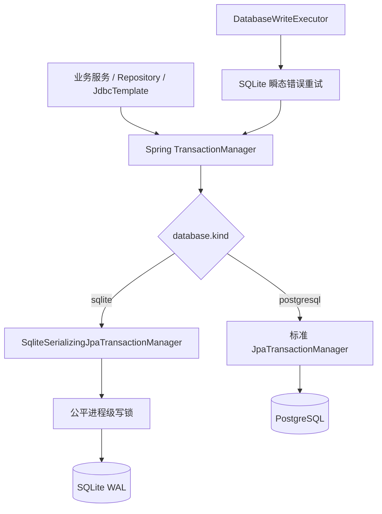

# SQLite 写事务协调与 PostgreSQL 适配设计

## 1. 背景

生产日志在 `collect-fetch-worker` 更新 `biz_author_profile` 时连续出现：

```text
[SQLITE_BUSY] The database file is locked
SQLite write was busy; retrying ... attempt=2/3 delayMs=121
SQLite write was busy; retrying ... attempt=3/3 delayMs=221
[CollectWorker] failed ... code=UNEXPECTED ... nextState=QUEUED
```

同一时间 `AuthorEnrichmentWorker`、收藏队列状态、运行心跳和其他后台任务也会写同一个 SQLite 文件。当前 Hikari 连接池允许 4 个连接，SQLite 则只有一个写锁。已有 `SqliteWriteRetrier` 能在新事务中重试，但它不能阻止不同线程在同一时刻开始写事务，且默认 3 次重试总等待不足 1 秒。

路线图已经规定“SQLite 写事务必须短小且单写者”，当前实现只完成了“短事务 + 重试”，没有完成进程内单写协调。

## 2. 已确认决策

1. 近期继续使用 SQLite，先修复锁竞争，不以立即迁移 PostgreSQL 代替修复。
2. 进程内所有 Spring 管理的非只读事务统一串行化；读事务保持 WAL 下的并发能力。
3. 外部 HTTP、媒体下载、文件操作和 FFmpeg 不得持有数据库写锁。
4. `SQLITE_BUSY` 必须保留为明确错误类型，不能包装成 `UNEXPECTED`。
5. 数据库写执行器和事务管理器按 `streamvault.database.kind` 条件装配，为 PostgreSQL 保留标准并发事务。
6. 收藏任务重复检测采用“直接禁止新增并提示已有任务”，但该 UI/业务修复放在紧随本设计后的独立改动中，不与底层锁修复混在同一提交。

## 3. 目标

- 消除应用进程内部多个写线程之间的大部分 `SQLITE_BUSY/SQLITE_BUSY_SNAPSHOT`。
- 保留 Hikari 多连接和 WAL 并发读取，不把连接池粗暴缩减为 1。
- 对外部进程或未纳入协调的短暂锁保留有界重试。
- 明确记录写锁等待时间、活动事务和最终失败原因。
- 收藏任务遇到最终锁失败时进入短延迟重试，而不是记录为未知异常并等待 15 分钟。
- PostgreSQL profile 不启用 SQLite 写锁，不限制 PostgreSQL 多写并发。

## 4. 非目标

- 本次不迁移生产数据库，不引入 PostgreSQL、Flyway 或 Redis 依赖。
- 不通过扩大 SQLite 文件或调整快照字段掩盖写锁问题。
- 不在一个巨大事务中包住整次收藏抓取或作品下载。
- 不承诺协调本应用之外的 SQLite 写入程序；外部写者由 `busy_timeout` 和有界重试处理。
- 不在本提交实现收藏任务搜索框、重复任务提示 UI 或作者列表删除按钮。

## 5. 根因分析

### 5.1 进程内没有统一单写者

当前这些路径都可能独立开启 `REQUIRES_NEW` 或 Repository 写事务：

- 收藏 job/run 领取、状态迁移、心跳、重试。
- 收藏作品入库及任务统计更新。
- 作者档案归集与名称历史更新。
- 作者外部 profile 补全队列。
- 运行暂停状态。
- 数据库维护操作。

`SqliteWriteRetrier` 只包住部分新路径，不能形成全局互斥；直接 Repository 写入仍可与它竞争。

### 5.2 `busy_timeout` 未被运行时证明

Docker URL 声明：

```properties
spring.datasource.url=jdbc:sqlite:/app/db/spirit.db?journal_mode=WAL&busy_timeout=10000
```

但日志中的每次写入几乎立即返回 `SQLITE_BUSY`。因此不能只相信配置文本，应用启动后必须读取并记录实际 PRAGMA 值。

### 5.3 错误分类丢失

`CollectDataService.executeQueuedCollectTask()` 捕获通用 `Exception` 后包装为 `IllegalStateException`，导致 `CollectJobWorker` 走 `UNEXPECTED` 分支。最终日志和重试策略都失去数据库锁语义。

## 6. 架构



事务管理器负责“所有写事务只允许一个进入”；写执行器负责“外部锁或瞬态错误时重新开始一次完整事务”。两者职责不能混合。

## 7. SQLite 串行事务管理器

新增条件化事务管理器：

```java
public final class SqliteSerializingJpaTransactionManager extends JpaTransactionManager {
    private final ReentrantLock writerLock = new ReentrantLock(true);
    private final ThreadLocal<Integer> writeDepth = ThreadLocal.withInitial(() -> 0);

    @Override
    protected void doBegin(Object transaction, TransactionDefinition definition) {
        boolean write = !definition.isReadOnly();
        if (write) {
            acquireWriterLock(definition.getName());
        }
        try {
            super.doBegin(transaction, definition);
        } catch (RuntimeException error) {
            if (write) releaseWriterLock();
            throw error;
        }
    }

    @Override
    protected void doCleanupAfterCompletion(Object transaction) {
        boolean write = isWriteTransaction(transaction);
        try {
            super.doCleanupAfterCompletion(transaction);
        } finally {
            if (write) releaseWriterLock();
        }
    }
}
```

实际实现不能依赖上面简化示例中的 `isWriteTransaction()` 猜测，而应在事务对象或独立 `ThreadLocal` 栈中记录每层事务是否取得锁。

规则：

1. 锁必须在数据库事务开始前取得。
2. 锁必须在 commit/rollback 和连接归还后释放。
3. 使用公平 `ReentrantLock(true)`，避免收藏 worker 长期压住作者补全。
4. 同线程嵌套事务允许可重入；每层 begin/cleanup 必须配对。
5. `readOnly=true` 不取得写锁。
6. 等待超过告警阈值时记录等待者、当前持有者、事务名和持续时间。
7. 等待超过硬超时时抛出 `DatabaseWriteContentionException`，不能无限挂死。

建议默认值：

```properties
streamvault.sqlite.writer-lock.warn-after-ms=1000
streamvault.sqlite.writer-lock.timeout-ms=30000
```

## 8. 条件化数据库基础设施

新增配置边界：

```java
@Configuration
public class DatabaseTransactionConfiguration {
    @Bean
    @ConditionalOnProperty(name="streamvault.database.kind", havingValue="sqlite", matchIfMissing=true)
    PlatformTransactionManager sqliteTransactionManager(EntityManagerFactory emf, ...) {
        return new SqliteSerializingJpaTransactionManager(emf, ...);
    }

    @Bean
    @ConditionalOnProperty(name="streamvault.database.kind", havingValue="postgresql")
    PlatformTransactionManager postgresTransactionManager(EntityManagerFactory emf) {
        return new JpaTransactionManager(emf);
    }
}
```

PostgreSQL 实现不得复用进程级写锁。将来 PostgreSQL worker 可依靠行锁和 `FOR UPDATE SKIP LOCKED` 并行领取任务。

## 9. 通用写执行器

业务服务不再直接依赖名为 `SqliteWriteRetrier` 的类型，改为数据库无关接口：

```java
public interface DatabaseWriteExecutor {
    <T> T execute(String operation, Supplier<T> newTransactionCall);
}
```

SQLite 实现：

- 识别 `SQLITE_BUSY`、`SQLITE_BUSY_SNAPSHOT` 和锁获取异常。
- 每次尝试必须调用一个新的 `REQUIRES_NEW` 事务代理。
- 记录 operation、attempt、delay、根因和总耗时。
- 绝不复用失败事务的 EntityManager。

建议默认重试：

```properties
streamvault.sqlite.write-retry.max-attempts=6
streamvault.sqlite.write-retry.initial-delay-ms=150
streamvault.sqlite.write-retry.max-delay-ms=2000
```

总等待约 4-7 秒，具体受 jitter 影响。30 秒写锁硬超时仍是最终上限。

PostgreSQL 预备实现：

- 当前阶段可以直接执行 action。
- 后续只重试明确的 deadlock、serialization failure 和连接瞬断。
- 不得用 SQLite 错误字符串判断 PostgreSQL 异常。

## 10. PRAGMA 配置与启动验证

SQLite JDBC URL 显式包含：

```properties
spring.datasource.url=jdbc:sqlite:/app/db/spirit.db?journal_mode=WAL&busy_timeout=10000&foreign_keys=on&synchronous=NORMAL
```

新增只读启动检查：

```sql
PRAGMA journal_mode;
PRAGMA busy_timeout;
PRAGMA foreign_keys;
PRAGMA synchronous;
```

启动日志示例：

```text
[SQLiteRuntime] journalMode=wal busyTimeoutMs=10000 foreignKeys=true synchronous=normal poolSize=4
```

验收要求：

- `journal_mode` 不是 WAL：生产启动失败。
- `busy_timeout < 5000`：生产启动失败；开发环境告警。
- `foreign_keys = 0`：生产启动失败。
- 检查只读，不修改生产业务表。

## 11. 事务边界审计

实现时扫描所有 `@Transactional` 非只读方法和直接写 DAO/JdbcTemplate 调用。

必须调整的长事务风险：

1. 写事务内不得执行网络 profile 请求。
2. 写事务内不得下载媒体或执行 FFmpeg。
3. 写事务内不得 sleep/backoff。
4. Quartz 调度创建、删除等外部副作用应在数据库提交后执行；失败时记录并补偿。
5. 一批作品不得放入一个覆盖整轮抓取的大事务；按单作品或小批次提交。

发现违反项时拆为：准备数据 -> 短事务写库 -> 提交后副作用。

## 12. 收藏任务错误语义

`executeQueuedCollectTask()` 必须保留数据库异常：

```java
} catch (CollectFetchException error) {
    throw error;
} catch (DataAccessException error) {
    throw error;
} catch (Exception error) {
    throw new IllegalStateException(..., error);
}
```

`CollectJobWorker` 分类：

| 场景 | errorCode | run state | 下次重试 |
|---|---|---|---:|
| SQLite 最终锁失败 | `SQLITE_BUSY` | `DB_FAILED` | 30 秒 |
| 其他数据库写失败 | `DB_WRITE_FAILED` | `DB_FAILED` | 60 秒 |
| Cookie/风控 | 原有代码 | `FETCH_FAILED` | 原有长退避 |
| 未识别运行时错误 | `UNEXPECTED` | `DB_FAILED` | 15 分钟 |

错误日志必须包含 operation、taskId、runId、等待时长和持锁事务，不输出 Cookie 或完整原始 JSON。

## 13. 与 PostgreSQL 迁移的衔接

本设计为 PostgreSQL 提供以下准备：

1. 业务层依赖 `DatabaseWriteExecutor`，不依赖 SQLite 类名。
2. 事务管理器按数据库类型条件装配。
3. SQLite 锁、PRAGMA 和错误判断集中在 `database/sqlite` 包。
4. job claim 继续位于 transaction/repository 边界；后续可替换为 PostgreSQL `SKIP LOCKED` 实现。
5. 错误码采用通用 `DB_WRITE_FAILED` 加数据库特定 `SQLITE_BUSY`，便于 PostgreSQL 增加 `PG_SERIALIZATION_FAILURE`。
6. 指标命名使用 `database.write.*`，数据库类型作为 tag，不将 SQLite 写死在通用看板字段中。

建议包结构：

```text
com.flower.spirit.database
  DatabaseWriteExecutor.java
  DatabaseWriteContentionException.java
  DatabaseRuntimeSnapshot.java
com.flower.spirit.database.sqlite
  SqliteDatabaseWriteExecutor.java
  SqliteSerializingJpaTransactionManager.java
  SqliteRuntimeVerifier.java
com.flower.spirit.database.postgresql
  PostgresDatabaseWriteExecutor.java   # 后续启用
```

## 14. 可观测性

运行状态接口增加：

- `databaseKind`
- `writerLocked`
- `writerOwnerThread`
- `writerOperation`
- `writerHeldMs`
- `writerWaitingCount`
- `writeBusyRetryCount`
- `writeLockTimeoutCount`
- `busyTimeoutMs`
- `journalMode`

日志分级：

- 等待小于 1 秒：debug。
- 超过 1 秒：warn。
- 最终超时或数据库 busy 重试耗尽：error。
- 正常短写不逐条 info，避免收藏任务日志膨胀。

## 15. 测试

### 15.1 单元测试

- 两个写事务并发进入时，第二个必须等第一个提交后开始。
- 多个等待者按公平顺序取得锁。
- 只读事务不取得写锁。
- 嵌套和 `REQUIRES_NEW` 正确增减可重入深度。
- begin 失败、commit 失败、rollback 和线程中断都释放锁。
- 锁等待超时抛出明确异常并带活动 operation。
- SQLite executor 对 busy 使用新事务重试 6 次。
- PostgreSQL/direct executor 不进入 SQLite 锁。

### 15.2 集成测试

使用临时 SQLite WAL 数据库并发执行：

1. 收藏 run 状态更新。
2. 作者 profile 更新。
3. 作者补全 job 完成。
4. 运行状态写入。

断言：

- 无 `SQLITE_BUSY` 泄漏到业务层。
- 最终数据全部提交。
- 读查询在一个短写事务期间仍可完成。
- 事务失败后下一次写入可正常提交。

### 15.3 回归测试

- 收藏 worker 遇到人为外部锁时记录 `SQLITE_BUSY`，生成 30 秒后的 retry run。
- 外部锁释放后重试成功，原 job 不重复创建作品。
- 作者补全和收藏作者归集不互相中断。
- 暂停、恢复、数据库维护 preview/apply 行为不变。

## 16. 发布步骤

1. 在生产数据库副本运行完整测试，不修改副本业务数据以外的临时测试库。
2. 部署前暂停收藏、下载和 HLS，等待现有任务结束。
3. 冷备份 `spirit.db`、`-wal` 和 `-shm`，记录 hash。
4. 部署后确认 `[SQLiteRuntime]` 检查通过。
5. 先恢复一条收藏任务和作者补全 worker，观察 30 分钟。
6. 检查 busy retry、锁等待和队列积压，再恢复全部任务。
7. 若出现写锁未释放或 API 长时间阻塞，暂停任务并回滚应用版本；数据库 schema 本次不变。

## 17. 验收标准

- 相同压力下不再出现进程内作者补全与收藏 worker 互锁导致的收藏任务中断。
- `SQLITE_BUSY` 最终失败能被准确分类、短延迟重试且可在运行记录中查看。
- 首页和 Feed 读请求不因写锁协调被全局串行化。
- 应用启动日志能证明 WAL、busy timeout 和 foreign keys 的真实运行值。
- PostgreSQL profile 使用标准事务管理器，不继承 SQLite 单写锁。
- 无网络、文件下载或 FFmpeg 操作位于写锁持有区间。

## 18. 后续独立改动

SQLite 修复验收后，按已确认行为继续：

1. 收藏任务按标准化 `platform + originaladdress` 检测重复，重复时禁止新增并返回已有任务 ID/名称/状态。
2. 收藏任务页增加关键词输入框，搜索任务名称、任务 ID、来源地址和平台。
3. 作者列表增加删除入口，复用现有 preview、confirmation token、异步删除和状态轮询 API。

