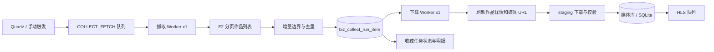

# 收藏抓取与下载双阶段流水线设计

## 1. 目标与范围

本设计重构抖音收藏任务的运行模型，把“抓作者作品列表”和“下载单个媒体”从同一个串行 worker 中拆开。目标是：

1. 抓取完成后立即释放抓取 worker，不再等待所有媒体下载完成。
2. 单个作品下载失败只影响该作品，后续作品和其他作者继续运行。
3. 日常监控改为真正的增量分页抓取，不再每轮重抓全部历史前缀。
4. 空作品列表、账号注销、上游空页和 F2 内部异常必须显示真实原因。
5. 保持 SQLite 的短写事务和单写协调，为后续 PostgreSQL 的并发领取预留边界。
6. 在收藏任务页、运行状态页和运行明细页分别展示抓取、下载和 HLS 的真实状态。

本次不迁移 PostgreSQL，不引入 Redis，不自动重跑旧历史 `PENDING` 项，也不修改生产数据库中的既有媒体数据。

## 2. 已确认的产品决策

| 项目 | 决策 |
| --- | --- |
| 调度频率 | 用户自行把全局收藏调度间隔改为 6 小时。代码不覆盖此设置。 |
| 阶段语义 | 作品列表写入计划后，抓取状态立即完成；下载继续以独立状态运行。 |
| 日常抓取 | 从最新页开始，连续 20 个已知作品且已跨过发布时间水位后停止。 |
| 历史修复 | 与日常监控分开，通过显式“全量审计”入口执行。 |
| 并行度 | 初始为 1 个抓取 worker + 1 个下载 worker。两个阶段并行，SQLite 写入仍短事务串行。 |
| 下载失败 | 单作品最多 3 次自动重试，间隔为 1 分钟、5 分钟、30 分钟。 |
| 公平性 | 多作者近似轮转，不能让单个长作者独占下载队列。 |
| 旧数据 | 不自动把历史 run item 重新下载。 |

## 3. 已核实的现状与根因

### 3.1 当前链路完全串行

`CollectJobWorker` 使用单线程执行器。`CollectDataService.createDyData(...)` 的顺序是：

```text
F2 分页抓取完整列表
-> 写临时 JSON
-> 读取、排序、保存 run item
-> 在同一个方法中逐个下载和入库
-> 当前作者所有作品结束
-> 领取下一位作者
```

因此一条慢视频、网络异常或历史扫描都会阻塞后续作者的列表抓取。

关键代码：

- `backstage/src/main/java/com/flower/spirit/service/CollectJobWorker.java`
- `backstage/src/main/java/com/flower/spirit/service/CollectDataService.java`
- `backstage/src/main/java/com/flower/spirit/service/transaction/CollectQueueTransaction.java`

### 3.2 当前“增量”实际上是重扫历史前缀

`CollectDataService.getDYData(...)` 当前在已有历史详情时计算：

```java
maxc = min(successCountByDataid + monitorWindow, 2000);
```

例如已有 500 个成功详情、监控窗口为 20，则每次 F2 都从最新页开始抓 520 条。F2 每页 20 条，且默认页间等待，任务历史越长，单次抓取越慢。

原意是同时获取最新作品和补偿历史遗漏，但两个目标被混在同一个日常任务里。日常监控应只追踪最新边界，历史遗漏应由下载队列重试和独立审计处理。

### 3.3 F2 分页语义

项目调用 F2：

```python
handler.fetch_user_post_videos(uid, 0, 0, 20, maxc)
```

F2 以 `max_cursor=0` 从最新页开始，`page_counts=20`。每个响应的 `has_more=1` 表示还有下一页，下一页使用响应的 `max_cursor`；它不是“数量加一”。循环在以下条件之一停止：

1. 已收集数量达到 `maxc`。
2. `has_more=0`。
3. 到达指定时间边界。

当前没有持久化跨轮游标，每轮都从最新页重新扫描。

### 3.4 `nickname_raw` 异常的真实原因

F2 在 `fetch_user_post_videos` 末尾无条件使用 `nickname_raw` 发送通知。若整个遍历没有任何有效作品，变量没有初始化，F2 抛出：

```text
UnboundLocalError: cannot access local variable 'nickname_raw'
```

它是 F2 的错误落点，不代表项目中的 nickname 数据损坏，也不能一概归因 Cookie 或风控。

生产日志已经证实四种不同上游情况：

| 任务 | 证据 | 正确分类 |
| --- | --- | --- |
| 汐柔同学 | Profile 可查，作品接口 `aweme_list=[]`、`has_more=0` | `NO_PUBLIC_WORKS` |
| 咚不胖脸 | Profile 的 `special_state_info` 明确指出账号已注销 | `ACCOUNT_DEACTIVATED` |
| 颖不颖 | Profile 可查，作品接口返回 `aweme_list=null` | `WORKS_UNAVAILABLE` |
| 温软 | 第一页 `aweme_list=[]` 但 `has_more=1` | `EMPTY_PAGE_CONTINUE` / `EMPTY_PAGINATION` |

任务名称是创建任务时的快照。作者目前昵称应以实时 profile 为准，不能用任务快照推断当前身份。

## 4. 目标架构



抓取和下载各自持久化、各自恢复、各自暂停。网络、文件系统和 FFmpeg 操作必须在数据库事务之外执行。

## 5. 阶段与状态模型

### 5.1 作者抓取 run

`biz_collect_run.state` 只表示作品列表抓取阶段。

```text
QUEUED -> FETCHING -> COMPLETED
```

失败或控制状态保持：

```text
FETCH_FAILED
DB_FAILED
INTERRUPTED
SKIPPED_PAUSED
CANCELLED
```

列表解析、增量判定和 run item 写入提交成功后，run 必须进入 `COMPLETED`，`COLLECT_FETCH` job 同时完成。它不等待媒体下载。

### 5.2 单作品下载 item

`biz_collect_run_item.process_state` 变为下载队列状态：

```text
PENDING -> QUEUED -> RUNNING -> COMPLETED
                   -> RETRY_WAIT -> RUNNING
                   -> FAILED
                   -> SKIPPED_EXISTING
                   -> SKIPPED_BLOCKED
                   -> SKIPPED_PAUSED
                   -> CANCELLED
```

迁移时允许旧数据库仍保存旧值；读取层必须把旧 `PENDING` 视为历史计划记录，而不是自动下载命令。只有新版本创建的 item 才设置可领取的 `QUEUED` 状态。

### 5.3 UI 汇总状态

任务页同时显示：

```text
抓取：排队中 / 抓取中 / 抓取完成 / 抓取失败
下载：待下载 N、下载中 N、等待重试 N、完成 N、已存在 N、失败 N
```

不能再依靠单一的 `biz_collect_data.taskstatus` 表达两个阶段。该字段保留兼容文本，页面以 run 和 item 聚合结果为准。

## 6. 日常真正增量算法

### 6.1 分页控制责任

不能继续沿用“F2 一次抓完 `maxc` 条，Java 再读取临时 JSON 判定边界”的结构。那样 Java 已经无法提前停止分页，最多只能减少后续下载，不能减少上游请求。

新增项目控制的 Python 子命令：

```text
fetch_douyin_list_incremental
```

它直接使用 F2 的 `DouyinCrawler` 和 `UserPost` 请求模型逐页请求，不调用有 `nickname_raw` 尾部缺陷的 `DouyinHandler.fetch_user_post_videos(...)` generator。参数包括：

```text
sec_user_id
known_work_ids_file
last_seen_publish_time
known_boundary=20
max_pages=20
mode=incremental | initial | audit
```

Java 在调用前从该收藏任务的 `biz_collect_data_detail` 读取历史 work ID，并合并仍处于 `QUEUED`、`RUNNING`、`RETRY_WAIT`、`COMPLETED` 的新流水线 run item work ID，写入仅包含 ID 的临时 JSON 文件；脚本读入后在内存中建立集合。这样下载尚未完成的新作品不会在下一轮重复入队。临时 known-ID 文件和结果文件都必须在 finally 中删除，不能写入数据库快照。

脚本逐页执行以下伪代码：

```python
for page in range(max_pages):
    response = await crawler.fetch_user_post(cursor)
    classify_raw_page(response)
    for work in response.aweme_list or []:
        item = normalize(work)
        if work.aweme_id in known_ids:
            known_streak += 1
            item["knownAtFetch"] = True
        else:
            known_streak = 0
            item["knownAtFetch"] = False
            new_work_ids.append(work.aweme_id)
        observed.append(item)
        if incremental and known_streak >= boundary and work.create_time <= watermark:
            return outcome("KNOWN_BOUNDARY", observed, new_work_ids)
    if not response.has_more:
        return outcome("NO_MORE", observed, new_work_ids)
    cursor = response.max_cursor
return outcome("MAX_PAGE_GUARD", observed, new_work_ids)
```

结果文件是一个对象而不是旧的裸数组：

```json
{
  "items": [],
  "newWorkIds": [],
  "outcome": "KNOWN_BOUNDARY",
  "pagesFetched": 3,
  "emptyPages": 0,
  "lastCursor": "...",
  "diagnostics": {}
}
```

`items` 保存本轮实际看到的全部作品，供“全量列表”和诊断使用；`newWorkIds` 只标识候选下载作品，供队列入队使用。`CollectDataService` 负责兼容读取旧命令的数组格式，以及新命令的对象格式。首次抓取和全量审计也使用这个项目控制的分页器，只是分别关闭 known boundary 或改用明确的 `omaxcur` / audit hard limit。

作者发布页 `post` 是本次真正增量边界的第一实现对象。`like`、`recommend` 和 `fav` 仍进入同一抓取后下载流水线，但必须通过各自 adapter 明确提供稳定的游标、排序和发布时间语义后才启用 known boundary；在此之前保留现有有界抓取方式，不得误用 post 的 sec_uid 规则。

### 6.2 首次抓取

没有成功抓取水位时，按现有 `omaxcur` 获取首次范围。首次抓取不使用已知边界停止。

### 6.3 水位数据

在 `biz_collect_data` 增加或复用明确的抓取元数据，保存：

```text
last_successful_fetch_at
last_seen_publish_time
last_seen_work_id
```

`last_seen_publish_time` 是上次成功列表中最新作品的发布时间，不使用“当前抓取时间”代替作品时间。

迁移 SQL 必须包括：

```sql
ALTER TABLE biz_collect_data ADD COLUMN last_successful_fetch_at TIMESTAMP;
ALTER TABLE biz_collect_data ADD COLUMN last_seen_publish_time VARCHAR(64);
ALTER TABLE biz_collect_data ADD COLUMN last_seen_work_id VARCHAR(255);
```

### 6.4 增量停止条件

每页按 API 返回顺序处理，列表中的置顶项按原顺序保留，不以简单时间排序破坏边界判定。对每个作品：

```text
若 work_id 不存在于本地媒体库、下载队列活跃项、或本轮已见集合：
    标记新作品
    连续已知计数归零
否则：
    连续已知计数加一

当连续已知计数 >= 20，且当前作品发布时间 <= last_seen_publish_time：
    正常停止本轮日常抓取
```

安全边界默认值配置为：

```properties
streamvault.collect.incremental-known-boundary=20
streamvault.collect.incremental-max-pages=20
```

`incremental-max-pages` 是防御性上限。达到上限时，抓取成功但标记停止原因 `MAX_PAGE_GUARD`，便于检查 Cookie 或上游顺序异常。

新作品出现在任意页时都重置“连续已知”计数。置顶旧作品不会直接终止抓取；必须同时满足连续边界和发布时间水位。

### 6.5 历史审计

新增显式“全量审计”操作。它：

1. 显示预览和用户确认。
2. 不使用日常已知边界。
3. 允许分页直到 `has_more=0`，同时设独立硬上限和可取消状态。
4. 只把本地缺失、失败或人工要求重新处理的作品排入下载队列。

日常任务不再承担历史修复职责。

## 7. F2 与上游异常处理

### 7.1 项目包装脚本

修改 `backstage/src/main/docker/buildx/script/douyin.py`，新增项目控制的逐页分页器。

分页器必须在每页响应后记录：

```text
page number
max_cursor
has_more
aweme_list 是否为空或 null
有效作品数
最后响应摘要
```

项目的 post 列表抓取不再调用会在收尾阶段访问 `nickname_raw` 的 F2 generator，因此空列表不会再因为该变量变成进程失败。对于保留的旧 F2 命令，仍捕获仅包含 `nickname_raw` 的 `UnboundLocalError`。若此前没有已解析作品，包装器写入空数组，并输出结构化成功标志，例如：

```text
stream-vault-ok
stream-vault-fetch-outcome={"kind":"EMPTY_RESULT", ...}
```

不能把其他 F2 异常吞掉。若曾成功产出作品后在尾部触发该 bug，也必须保留已产出的列表并标记 `PARTIAL_RESULT`。

### 7.2 F2 版本可复现性

所有 Dockerfile 的：

```dockerfile
pip install --no-cache-dir f2
```

改为固定的、经过测试的精确版本。构建时记录版本；应用启动日志也输出实际 `f2 --version` 或 Python package metadata。版本选择必须先在本地构建环境验证当前 wrapper 兼容性后写入，不在 spec 中猜测版本号。

### 7.3 Java 端分类

`CollectDataService` 的 F2 诊断结果增加明确分类：

| 条件 | errorCode | run 处理 |
| --- | --- | --- |
| 空数组且 `has_more=0` | `NO_PUBLIC_WORKS` | 抓取成功，数量为 0 |
| profile 明确注销 | `ACCOUNT_DEACTIVATED` | 记录警告，不做立即重试 |
| `aweme_list=null` | `WORKS_UNAVAILABLE` | 记录诊断，不做快速重试 |
| 空页且 `has_more=1` | `EMPTY_PAGE_CONTINUE` | 继续游标，最多连续 3 页 |
| 连续空页没有有效作品 | `EMPTY_PAGINATION` | 正常结束并标记 warning |
| Cookie、验证码、登录 | `F2_COOKIE_OR_VERIFY_REQUIRED` | 走现有 Cookie 健康状态和延迟重试 |
| 上游 HTTP 或 JSON schema 异常 | `UPSTREAM_SCHEMA_ERROR` | 记录摘要并重试 |

账号注销默认不自动停用收藏任务，避免误判造成永久停止；页面提供手动停用与手动刷新入口。

## 8. 下载队列实现

### 8.1 为什么复用 run item

`biz_collect_run_item` 已持有：run、顺序、平台、作品 ID、作者 ID、标题快照、发布时间、媒体类型、决策和错误信息。它是天然的持久化作品计划，不再创建第二套重复 download job 表。

### 8.2 schema 增量

为 `biz_collect_run_item` 增加：

```sql
ALTER TABLE biz_collect_run_item ADD COLUMN attempt_count INTEGER NOT NULL DEFAULT 0;
ALTER TABLE biz_collect_run_item ADD COLUMN max_attempts INTEGER NOT NULL DEFAULT 4;
ALTER TABLE biz_collect_run_item ADD COLUMN available_at TIMESTAMP;
ALTER TABLE biz_collect_run_item ADD COLUMN locked_by VARCHAR(255);
ALTER TABLE biz_collect_run_item ADD COLUMN locked_at TIMESTAMP;
ALTER TABLE biz_collect_run_item ADD COLUMN started_at TIMESTAMP;
ALTER TABLE biz_collect_run_item ADD COLUMN finished_at TIMESTAMP;
ALTER TABLE biz_collect_run_item ADD COLUMN error_detail CLOB;
ALTER TABLE biz_collect_run_item ADD COLUMN queue_generation VARCHAR(32);
```

`queue_generation` 标记由新流水线创建的 item，例如 `FETCH_DOWNLOAD_V1`。迁移后的旧记录保持 `NULL`，不会被下载 worker 领取。

新增索引：

```sql
CREATE INDEX IF NOT EXISTS idx_collect_run_item_download_claim
ON biz_collect_run_item(queue_generation, process_state, available_at, ordinal, created_at, id);

CREATE INDEX IF NOT EXISTS idx_collect_run_item_active_work
ON biz_collect_run_item(platform_key, work_id, process_state);
```

SQLite 不支持所有 PostgreSQL 风格的条件索引语义时，迁移代码必须采用 SQLite 兼容 SQL。生产 schema 初始化使用幂等 `ensureColumn` 和 `CREATE INDEX IF NOT EXISTS`，并在 preflight 中验证字段和索引存在。

### 8.3 新作品入队

抓取阶段先把所有返回作品写入 run item，再对每项判定：

1. 已存在完整本地媒体和数据库记录：`SKIPPED_EXISTING`。
2. 被禁止下载：`SKIPPED_BLOCKED`。
3. 同一 `platform_key + work_id` 已有活跃下载项：新 run item 标记 `SKIPPED_EXISTING_ACTIVE_DOWNLOAD`，避免重复下载。
4. 其他新作品：`QUEUED`，`available_at=now`，`queue_generation=FETCH_DOWNLOAD_V1`。

不持久化抖音签名下载 URL。等待队列可能持续数小时，下载开始时必须重新请求作品详情，获取新的 URL。

### 8.4 领取算法

新增 `CollectDownloadWorker` 和对应 transaction service。SQLite 领取必须使用两个短步骤：

```text
SELECT 一个符合条件的 QUEUED / RETRY_WAIT item
ORDER BY 手动优先级、ordinal、available_at、created_at、id

UPDATE 同一 item
SET process_state='RUNNING', attempt_count=attempt_count+1,
    locked_by=?, locked_at=?, started_at=COALESCE(started_at, ?)
WHERE id=? AND process_state IN ('QUEUED','RETRY_WAIT')
```

只有 `UPDATE` 影响一行时才真正领取。网络请求和文件下载在该事务提交后执行。

以 `ordinal` 优先可让各 run 的第 1 条、新作品先被处理，然后才到各 run 的第 2 条，形成近似作者轮转。手动重试项有更高优先级。

PostgreSQL 后续替换为：

```sql
SELECT ...
FOR UPDATE SKIP LOCKED
```

业务状态和 worker 接口保持不变。

### 8.5 单作品执行

每次下载：

```text
检查运行时 MEDIA_DOWNLOAD 暂停开关
-> 再查本地媒体库去重
-> 用 work_id 请求最新详情
-> 验证作者和作品 ID
-> 下载到 staging
-> 校验资源非空
-> 原子提升到目标目录
-> 短事务写入媒体记录、详情记录、item 完成状态
-> 提交后入队 HLS
```

图文集视为一条作品。任一图片或内嵌视频失败时，staging 目录回滚，整条 item 重试，不能留下半入库图文作品。

### 8.6 下载错误与重试

对单作品捕获 `IOException`、下载器包装异常、OkHttp `IllegalStateException`、媒体校验异常和详情刷新异常。错误必须转换为显式 `MediaDownloadException`，而不是逃出到作者抓取 worker。

| 尝试次数 | 后续状态 | 延迟 |
| --- | --- | --- |
| 第 1 次失败 | `RETRY_WAIT` | 1 分钟 |
| 第 2 次失败 | `RETRY_WAIT` | 5 分钟 |
| 第 3 次失败 | `RETRY_WAIT` | 30 分钟 |
| 第 4 次失败 | `FAILED` | 等待人工重试或全量审计 |

这表示首次下载之外还有 3 次自动重试，单作品最多 4 次下载尝试。每次重试都重新获取详情和媒体 URL。任务 158 的 `unexpected end of stream` 属于单作品网络失败，不能重启整个作者任务。

## 9. 并发、暂停与恢复

新增配置：

```properties
streamvault.collect.fetch-workers=1
streamvault.collect.download-workers=1
streamvault.collect.incremental-known-boundary=20
streamvault.collect.incremental-max-pages=20
streamvault.collect.empty-page-limit=3
streamvault.collect.download-max-retries=3
```

创建新 item 时，`max_attempts = 1 + streamvault.collect.download-max-retries`，默认值为 4。

初始只启用一个抓取 worker和一个下载 worker。它们可并行运行：抓取 A 后立即继续抓取 B；下载 worker 同时处理 A 的作品。不要直接扩大抓取 worker 数量，因为同一 Cookie 的并发请求会增加风控风险。

`TaskCategory.COLLECT_FETCH` 只控制抓取。`TaskCategory.MEDIA_DOWNLOAD` 只控制下载。下载暂停后，worker 不再领取新 item；已在文件写入中的一条允许结束或在安全点中断，不能长期持有数据库锁。

应用启动时，超过锁超时的 `RUNNING` 下载 item 转为 `RETRY_WAIT`。staging 目录不视为成功；目标文件已存在但数据库记录缺失时，由补偿检查创建或恢复正确记录，避免重复覆盖。

SQLite 仍由 `DatabaseWriteExecutor` 和事务协调器串行短写；外部 HTTP、下载、文件操作、F2、sleep 和 HLS 均不在写事务中。

## 10. API 与页面

### 10.1 收藏任务列表

扩展 `CollectTaskListItem` 和任务列表 API：

```json
{
  "fetchState": "COMPLETED",
  "downloadQueued": 18,
  "downloadRunning": 1,
  "downloadRetryWait": 2,
  "downloadCompleted": 36,
  "downloadSkipped": 420,
  "downloadFailed": 2,
  "latestStopReason": "KNOWN_BOUNDARY",
  "latestFetchWarning": "NO_PUBLIC_WORKS"
}
```

旧 `jobState`、`runState`、`queuePosition` 和 `heartbeatAt` 保持兼容，但页面优先使用新的阶段字段。

### 10.2 运行明细

现有“计划列表”和“全量列表”使用表格继续显示：

- 全量列表：本轮接口返回的作品。
- 计划列表：进入下载队列或等待重试的作品。
- 每行：作品 ID、标题、发布时间、媒体类型、下载状态、尝试次数、下一次尝试、最后错误、更新时间。

新增接口：

```text
POST /admin/collectData/retryItem?id={runItemId}
POST /admin/collectData/retryFailedItems?runId={runId}
POST /admin/collectData/audit?taskId={taskId}
GET  /admin/collectData/downloadQueue?taskId={taskId}
```

接口名称实施时以现有 `AdminController` 风格调整，但语义、权限和响应字段不得改变。

### 10.3 首页运行状态

`RuntimeJobQueryService` 和首页运行状态新增：

```text
抓取队列：等待、运行、重试
下载队列：等待、运行、重试、失败
HLS 队列：等待、运行
```

## 11. 具体代码改动边界

| 模块 | 改动 |
| --- | --- |
| `CollectJobWorker` | 抓取完成后结束 fetch job，不再进行媒体下载。 |
| `CollectDataService` | 把列表解析、增量边界、run item 创建从逐项下载逻辑分离；保留旧非持久化入口的兼容适配。 |
| `CollectQueueTransaction` | 支持抓取完成即完成 run；保存 item 时写入下载状态。 |
| 新增 `CollectDownloadWorker` | 单线程持久化 item 领取、恢复、执行、重试。 |
| 新增 `CollectDownloadTransaction` | SQLite 兼容的 claim、complete、retry、fail、recover 操作。 |
| `CollectRunItemEntity` | 映射新的队列字段。 |
| `CollectRunQueryService` | 返回下载计数、行状态、下一次尝试和错误详情。 |
| `CollectTaskListItem` | 增加抓取和下载分阶段字段。 |
| `RuntimeJobQueryService` | 聚合下载队列状态。 |
| `AdminController` | 增加队列查询、单项重试、失败项重试、全量审计接口。 |
| `collectDataList.html` | 表格化显示抓取与下载状态，提供重试和审计按钮。 |
| `douyin.py` | 新增项目控制的逐页 paginator，记录页级结果和停止原因；兼容处理旧 F2 的 `nickname_raw` 收尾异常。 |
| Dockerfile | 固定 F2 版本，并输出实际版本。 |
| `DatabaseIndexInitializer` / schema preflight | 迁移字段、创建索引、验证 schema。 |

## 12. 数据库迁移与兼容性

迁移使用可重复的增量方式：

```text
确认 biz_collect_run_item 表存在
-> 逐字段检查，不存在才 ADD COLUMN
-> 检查并补充 biz_collect_data 的抓取水位字段
-> 创建索引
-> 验证所有必需字段和索引
-> 记录启动前检查结果
```

不修改或删除以下历史表数据：

```text
biz_video
biz_graphic_content
biz_collect_data
biz_collect_data_detail
biz_author_profile
```

数据库 preflight 失败时，应用必须以明确日志停止队列启动，不能在部分迁移状态下领取任务。

## 13. 测试计划

### 13.1 单元测试

1. 新作品、已知作品、置顶旧作品、时间水位和连续边界组合。
2. 第一次抓取按 `omaxcur`，日常抓取按边界，全量审计忽略边界。
3. `has_more=0` 空数组、`aweme_list=null`、注销 profile、`has_more=1` 空页三页上限。
4. F2 `nickname_raw` 在无作品和部分作品两种情形的包装结果。
5. 下载 `IOException`、`IllegalStateException`、媒体校验失败都只改变 item 状态。
6. 1、5、30 分钟重试时间和最终 FAILED。
7. 同作品活跃下载去重。
8. 启动恢复超时 RUNNING item。
9. 下载暂停、抓取暂停互不影响。

### 13.2 SQLite 集成测试

1. 抓取 worker 和下载 worker 同时运行时，事务不持有网络或文件操作。
2. 两个 claimant 只能有一个成功领取同一 item。
3. `DatabaseWriteExecutor` 发生 busy 重试后，不重复保存媒体。
4. 新 schema 在现有生产数据库副本上可以读取历史数据。
5. 旧 run item 不会在升级后被自动领取。

### 13.3 页面与接口测试

1. 收藏任务页显示分阶段状态和自动刷新。
2. 计划列表、全量列表保持表格，不回退为 JSON 文本。
3. 单项重试与本轮失败重试正确回到 `QUEUED`。
4. 全量审计需要确认步骤，并显示范围和运行状态。
5. 首页正确显示抓取、下载、HLS 三类队列。

## 14. 发布步骤

1. 对本地生产数据库副本执行只读 schema preflight 和迁移集成测试。
2. 构建 Docker 镜像，确认 F2 精确版本与 SQLite runtime 参数出现在启动日志。
3. 生产部署前暂停抓取、下载和 HLS，等待已有运行项完成。
4. 备份 `spirit.db`、`spirit.db-wal`、`spirit.db-shm` 并记录 hash。
5. 部署后先启用一条小型测试任务，验证抓取完成后下载仍继续运行。
6. 验证单项失败不会终止同作者的下一条作品。
7. 验证无 SQLite lock 错误、无重复媒体和无历史 PENDING 自动重下后，再恢复全部任务。
8. 保持全局抓取间隔为用户设置的 6 小时。

## 15. 验收标准

1. 一个作者的慢下载不再阻塞其他作者的列表抓取。
2. 一条媒体网络失败后，后续作品继续执行，失败项可见、可重试、可追溯。
3. 日常已运行过的作者不再反复抓取全部历史成功作品。
4. F2 的 `nickname_raw` 异常不再掩盖“注销、无公开作品、上游空结构、分页空洞”等真实原因。
5. 抓取、下载、HLS 在页面和 API 中显示为独立状态。
6. 应用重启后未完成下载可恢复，临时文件不会被错误标记为成功。
7. SQLite 下没有网络或长文件操作处于写事务内，PostgreSQL 可在不改变业务语义的情况下替换领取 SQL。
